# Using sed utility

## 1. Display the lines that contain the word “lp” in /etc/passwd file.

```bash
sed -n '/lp/p' /etc/passwd
```

<p align="left">
  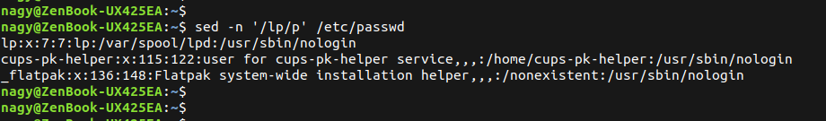
</p>

----------------------

## 2. Display /etc/passwd file except the third line.

```bash
sed '3d' /etc/passwd
```

<p align="left">
  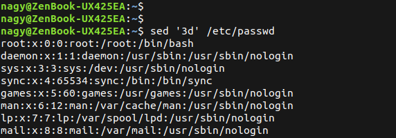
</p>

----------------------

## 3. Display /etc/passwd file except the last line

```bash
sed '$d' /etc/passwd
```

<p align="left">
  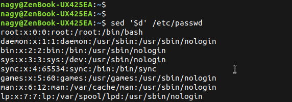
</p>

----------------------

## 4. Display /etc/passwd file except the lines that contain the word “lp”

```bash
sed '/lp/d' /etc/passwd
```

<p align="left">
  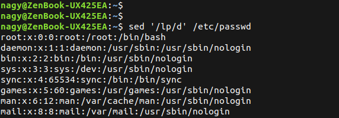
</p>

----------------------

## 5. Substitute all the words that contain “lp” with “mylp” in /etc/passwd file

```bash
sed 's/lp/mylp/g' /etc/passwd
```

<p align="left">
  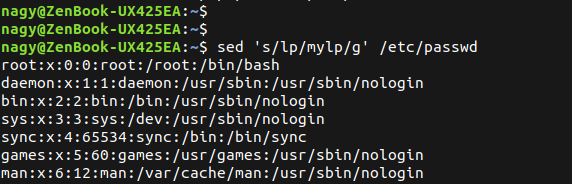
</p>

----------------------


# Using AWK utility

## 1. Print full name (comment) of all users in the system

```bash
awk -F: '{print $5}' /etc/passwd
```

<p align="left">
  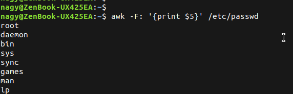
</p>

----------------------

## 2. Print login, full name (comment) and home directory of all users.( Print each line preceded by a line number)


```bash
awk -F: '{print NR, $1, $5, $6}' /etc/passwd
```

<p align="left">
  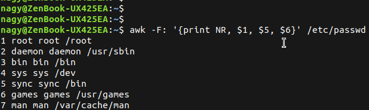
</p>

----------------------

## 3. Print login, uid and full name (comment) of those uid is greater than 500


```bash
awk -F: '$3 > 500 {print $1, $4, $5}' /etc/passwd
```

<p align="left">
  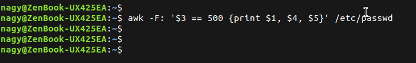
</p>

----------------------

## 4. Print login, uid and full name (comment) of those uid is exactly 500


```bash
awk -F: '$3 == 500 {print $1, $4, $5}' /etc/passwd
```

<p align="left">
  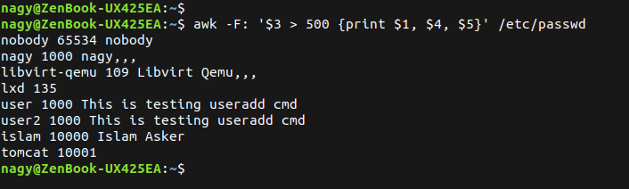
</p>

----------------------

## 5. Print line from 5 to 15 from /etc/passwd

```bash
awk -F: 'NR > 5 && NR < 15 {print NR, $1, $4, $5}' /etc/passwd
```

<p align="left">
  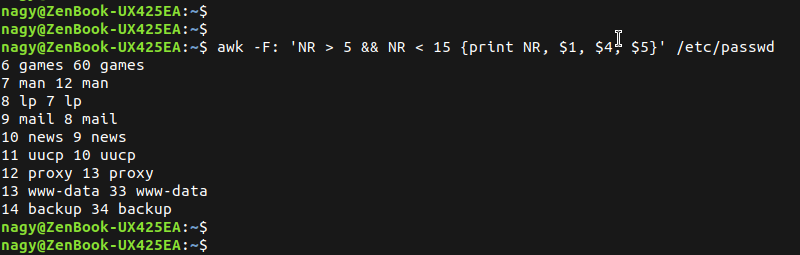
</p>

----------------------

## 6. Change lp to mylp

```bash
awk -F: 'BEGIN{FS=":"} {gsub(/\blp\b/,"mylp"); print}' /etc/passwd
```

<p align="left">
  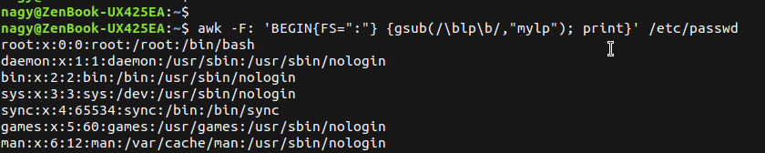
</p>

----------------------

## 7. Print all information about greatest uid.

```bash
awk -F: 'BEGIN{max=0} {if($3>max){max=$3; line=$0}} END{print line}' /etc/passwd
```

<p align="left">
  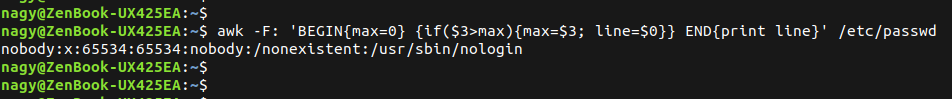
</p>

----------------------

## 8. Get the sum of all accounts id’s.

```bash
awk -F: '{sum+=$3} END{print "Sum of all UIDs =", sum}' /etc/passwd
```

<p align="left">
  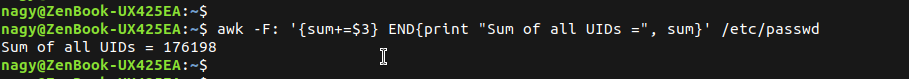
</p>

----------------------

## 9. Get the sum of accounts id’s that has the same group

```bash
awk -F: '{sum+=$3} END{print "Sum of all UIDs =", sum}' /etc/passwd
```

<p align="left">
  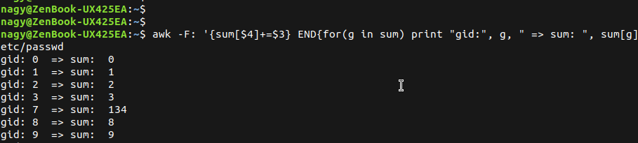
</p>

----------------------