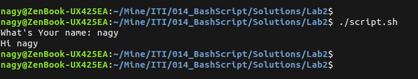
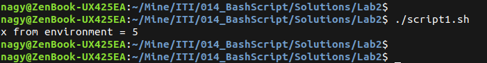
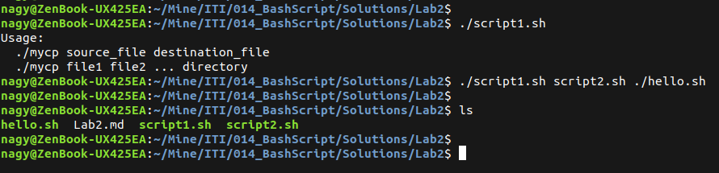
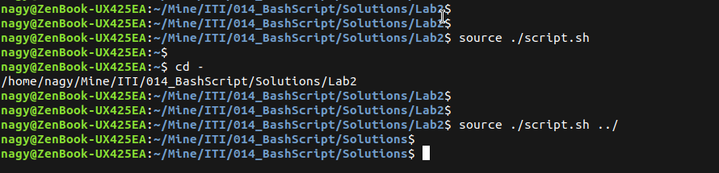
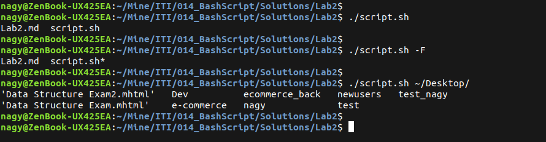
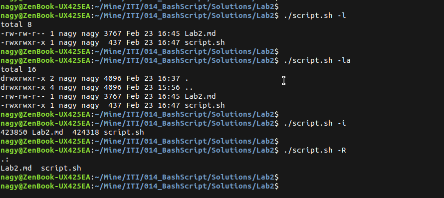
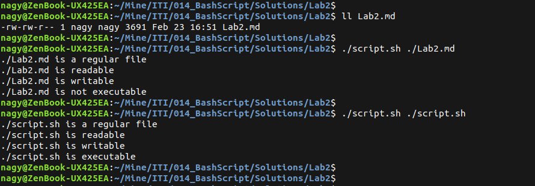
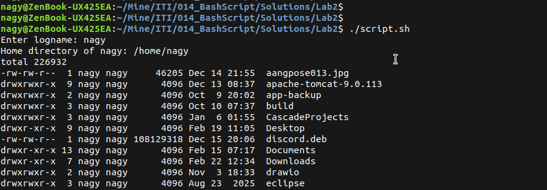

# Bash Script : Lab 2

## 1. Create a script that asks for user name then send a greeting to him.

```bash
#!/usr/bin/bash
read -p "What's Your name: " name
echo "Hi ${name}"
```

<p align="left">
  
</p>

----------------------

## 2. Create a script called s1 that calls another script s2 where in s1 there is a variable called x, it's value 5

```bash
#script1.sh
#!/usr/bin/env bash
export x=5
./script2.sh
```

```bash
#script2.sh
#!/usr/bin/env bash
echo "x from environment = $x"
```

<p align="left">
  
</p>

----------------------

## 3. Create a script called mycp where, It copies a file to another, It copies multiple files to a directory

```bash
#!/usr/bin/bash
#!/usr/bin/env bash

if [ $# -lt 2 ]; then
    echo "Usage:"
    echo "  ./mycp source_file destination_file"
    echo "  ./mycp file1 file2 ... directory"
    exit 1
fi

if [ $# -eq 2 ]; then
    if [ -f "$1" ]; then
        cp "$1" "$2"
    else
        echo "Error: $1 is not a file"
    fi
    exit 0
fi

dest="${@: -1}"
if [ ! -d "$dest" ]; then
    echo "Error: Last argument must be a directory"
    exit 1
fi

for file in "${@:1:$#-1}"; do
    if [ -f "$file" ]; then
        cp "$file" "$dest"
    else
        echo "Warning: $file is not a file"
    fi
done
```

<p align="left">
  
</p>

----------------------

## 4. Create a script called mycd where, It changed directory to the user home directory, if it is called without arguments, Otherwise, it change directory to the given directory

```bash
#!/usr/bin/env bash
if [ $# -eq 0 ]; then
    cd "$HOME" || exit
else
    cd "$1" || echo "Directory does not exist"
fi
```

<p align="left">
  
</p>

----------------------

## 5. Create a script called myls where, It lists the current directory, if it is called without arguments, Otherwise, it lists the given directory

```bash
#!/usr/bin/env bash
if [ $# -eq 0 ]; then ls
else ls "$1"
fi
```

<p align="left">
  
</p>

----------------------

## 6. Enhance the above script to support the following options individually:
- –l: list in long format
- –a: list all entries including the hiding files.
- –d: if an argument is a directory, list only its name
- –i: print inode number
- –R: recursively list subdirectories

```bash
#!/usr/bin/env bash

options=""
dir=""

for arg in "$@"; do
    if [ "$arg" = "-l" ];   then options="$options -l"
    elif [ "$arg" = "-a" ]; then options="$options -a"
    elif [ "$arg" = "-d" ]; then options="$options -d"
    elif [ "$arg" = "-i" ]; then options="$options -i"
    elif [ "$arg" = "-R" ]; then options="$options -R"
    else dir="$arg"
    fi
done

if [ -z "$dir" ]; then
    ls $options
else
    ls $options "$dir"
fi
```

<p align="left">
  
</p>

----------------------

## 7. Create a script called mytest where, It check the type of the given argument (file/directory), It check the permissions of the given argument (read/write/execute)

```bash
#!/usr/bin/env bash

if [ $# -eq 0 ]; then
    echo "Usage: ./mytest <file_or_directory>"
    exit 1
fi

item="$1"
if [ -f "$item" ]; then echo "$item is a regular file"
elif [ -d "$item" ]; then echo "$item is a directory"
else echo "$item is not a regular file or directory"
fi

[ -r "$item" ] && echo "$item is readable" || echo "$item is not readable"
[ -w "$item" ] && echo "$item is writable" || echo "$item is not writable"
[ -x "$item" ] && echo "$item is executable" || echo "$item is not executable"
```

<p align="left">
  
</p>

----------------------

## 8. Create a script called myinfo where, It asks the user about his/her logname, It print full info about files and directories in his/her home directory, Copy his/her files and directories as much as you can in /tmp directory, Gets his current processes status.

```bash
#!/usr/bin/env bash

read -p "Enter logname: " user

homedir=$(eval echo "~$user")

if [ ! -d "$homedir" ]; then
    echo "User $user not found"
    exit 1
fi

echo "Home directory of $user: $homedir"

ls -l "$homedir"

echo "Copying files/directories to /tmp..."
cp -r "$homedir"/* /tmp/ 2>/dev/null

echo "Current processes of $user:"
ps -u "$user"
```

<p align="left">
  
</p>

----------------------
