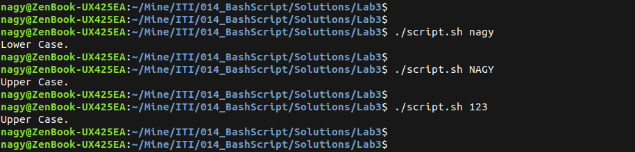
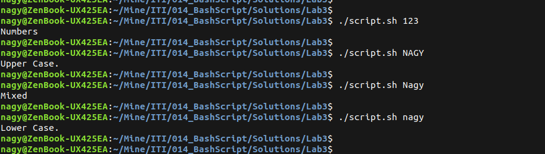
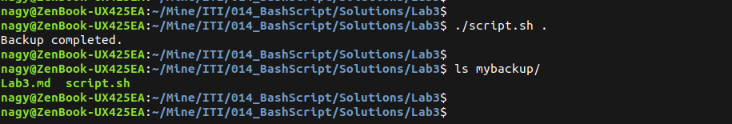
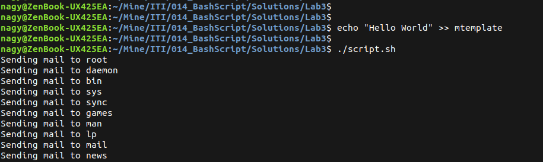
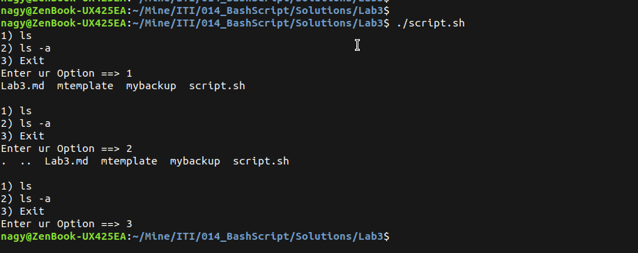
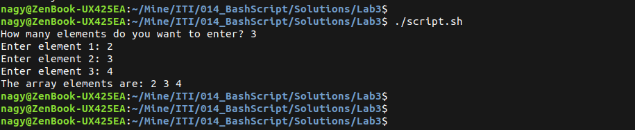
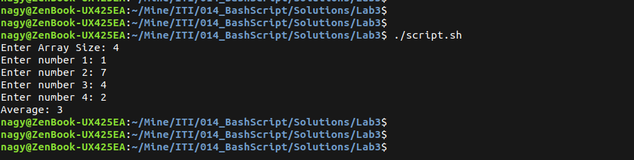
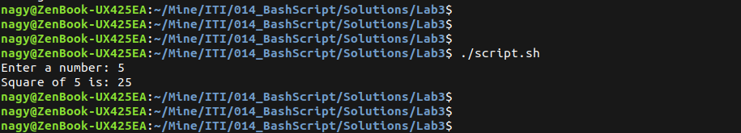

# Bash Script : Lab 3

## 1. Write a script called mycase, using the case utility to checks the type of character entered by a user: a. Upper Case. b. Lower Case. c. Number. d. Nothing

```bash
#!/bin/bash
shopt -s extglob
var=$1
case "$var" in
    +([a-z])) echo "Lower Case." ;;
    +([A-Z])) echo "Upper Case." ;;
    +([0-9])) echo "Numbers." ;;
    *) echo "Invalid input." ;;
esac
```

<p align="left">
  
</p>

---

## 2. Enhanced the previous script, by checking the type of string entered by a user: a. Upper Cases. b. Lower Cases. c. Numbers. d. Mix. e. Nothing.

```bash
#!/bin/bash
shopt -s extglob
var=$1
case "$var" in
    +([a-z])) echo "Lower Case." ;;
    +([A-Z])) echo "Upper Case." ;;
    +([0-9])) echo "Numbers" ;;
    +([a-zA-Z0-9])) echo "Mixed" ;;
esac
```

<p align="left">
  
</p>

---

## 3. Write a script called mychmod using for utility to give execute permission to all files and directories in your home directory.

```bash
#!/bin/bash
dir=$1
if [[ ! -d "$dir" ]]; then
    echo "wrong directory"
    exit 1
fi
for item in "$dir"/*
do
    chmod +x "$item"
done
echo "Done."
```

<p align="left">
  
</p>

---

## 4. Write a script called mybackup using for utility to create a backup of only files in your home directory.

```bash
#!/bin/bash
dir=$1
if [[ ! -d "$dir" ]]; then
    echo "Wrong directory"
    exit 1
fi
backup_dir="$dir/mybackup"
mkdir -p "$backup_dir"
for item in "$dir"/*
do
    if [[ -f "$item" ]]; then
        cp "$item" "$backup_dir"
    fi
done
echo "Backup completed."
```

<p align="left">
  
</p>

---

## 5. Write a script called mymail using for utility to send a mail to all users in the system. Note: write the mail body in a file called mtemplate.

```bash
#!/bin/bash
if [[ ! -f "mtemplate" ]]; then
    echo "Mail template file (mtemplate) not found."
    exit 1
fi
for user in $(cut -d: -f1 /etc/passwd)
do
    echo "Sending mail to $user"
    mail -s "System Notification" "$user" < mtemplate
done
echo "All mails sent."
```

<p align="left">
  
</p>

---

## 6. Write a script called chkmail to check for new mails every 10 seconds. Note: mails are saved in /var/mail/username.

```bash
#!/bin/bash

mailfile="/var/mail/$USER"
if [[ ! -f "$mailfile" ]]; then
    echo "Mail file not found for $USER"
    exit 1
fi

oldcount=$(wc -l < "$mailfile")
while true
do
    sleep 10
    newcount=$(wc -l < "$mailfile")
    if [[ $newcount -gt $oldcount ]]; then
        echo "You have new mail!"
        oldcount=$newcount
    fi
done
```

---

## 8. Create the following menu:
- a. Press 1 to ls
- b. Press 2 to ls –a
- c. Press 3 to exit
- Using select utility then while utility.

```bash
#!/bin/bash
PS3="Enter ur Option ==> "
options=("ls" "ls -a" "Exit")
while true
do
    select op in "${options[@]}"
    do
        case $REPLY in
            1) ls; break; ;;
            2) ls -a; break; ;;
            3) exit 0; break; ;;
        esac
    done
    echo ""
done
```

<p align="left">
  
</p>

---

## 9. Write a script called myarr that ask a user how many elements he wants to enter in an array, fill the array and then print it

```bash
#!/bin/bash
read -p "Enter Array Size: " n
arr=()
for (( i=0; i<n; i++ ))
do
    read -p "Enter element $((i+1)): " elem
    arr+=("$elem")
done
echo "Array elements are: ${arr[@]}"
```

<p align="left">
  
</p>

---

## 10. .Write a script called myavg that calculate average of all numbers entered by a user. Note: use arrays

```bash
#!/bin/bash
read -p "Enter Array Size: " n
arr=()
for (( i=0; i<n; i++ ))
do
    read -p "Enter number $((i+1)): " num
    numbers+=("$num")
    sum=$((sum + num))
done
avg=0
if [[ $n -gt 0 ]]; then
    avg=$((sum / n))
fi
echo "Average: $avg"
```

<p align="left">
  
</p>

---

## 11. Write a function called mysq that calculate square if its argument

```bash
#!/bin/bash
read -p "Enter a number: " n
result=$((n*n))
echo "Square of $n is: $result"
```

<p align="left">
  
</p>