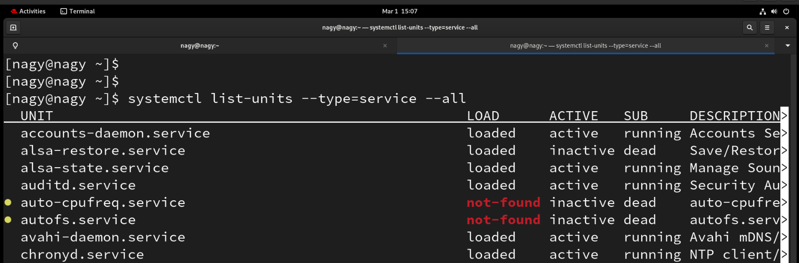
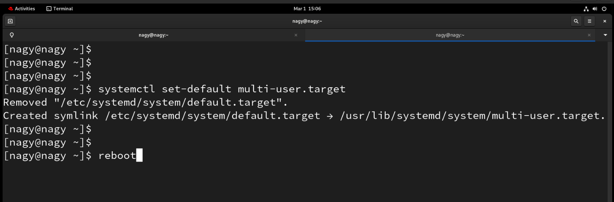
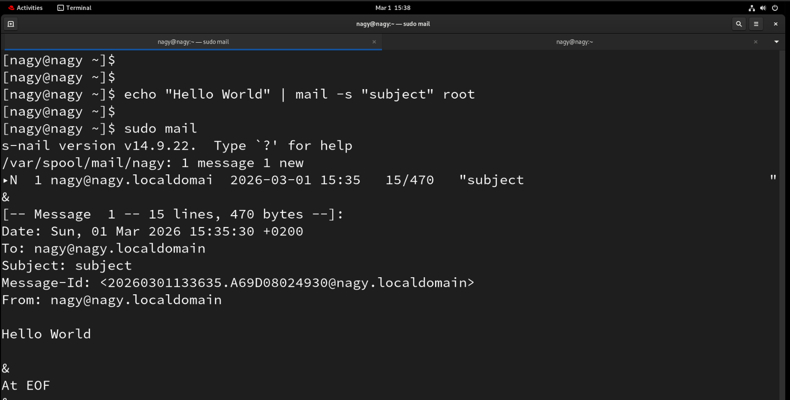
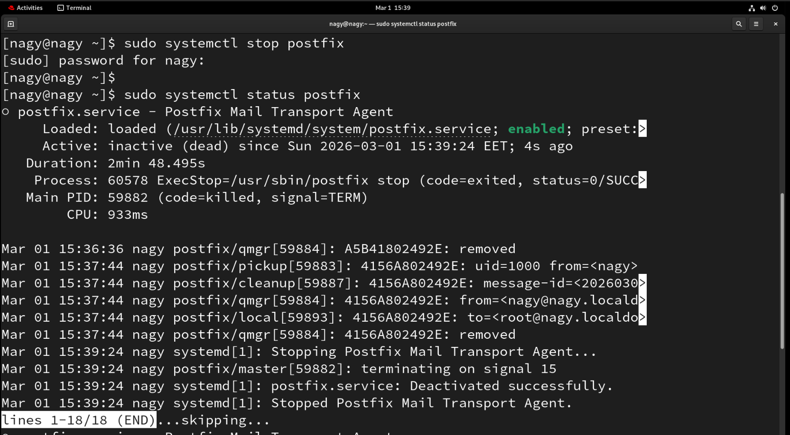
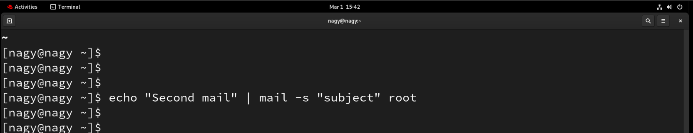
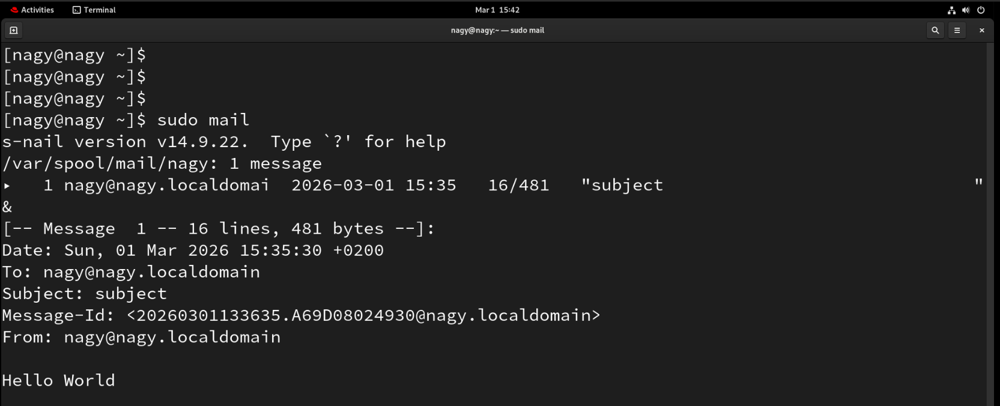
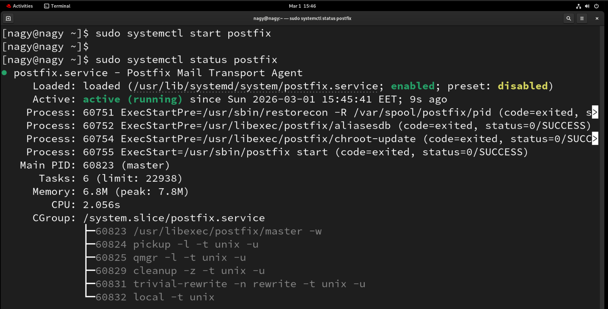
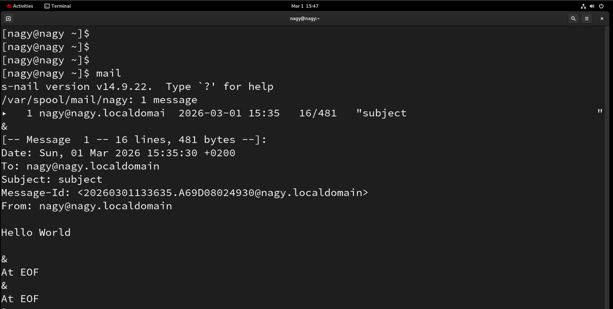
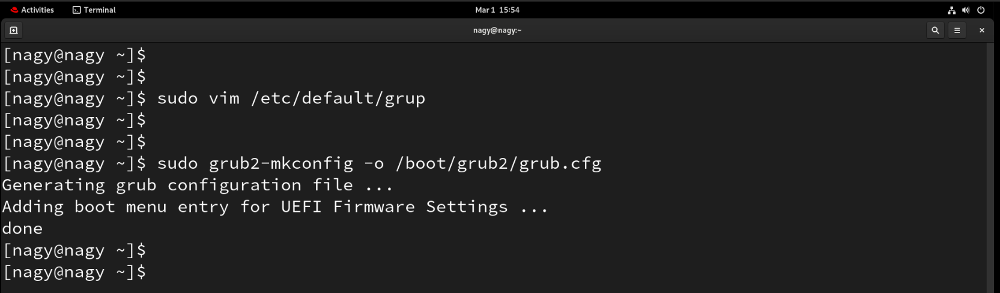
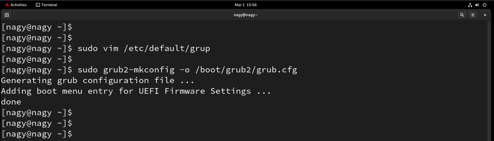

# SystemAdminII : Lab 1

## 1. Use systemctl to view the status of all the system services.

```bash
systemctl list-units --type=service --all
```

<p align="left">
  
</p>

----------------------

## 2. Change the default run level back to multi-user.target and reboot.

```bash
systemctl set-default multi-user.target
reboot
```

<p align="left">
  
</p>

----------------------

## 3. Send mail to the root user.

```bash
echo "Hello world" | mail -s "Subject" root
```

<p align="left">
  
</p>

--------------------

## 4. Verify that you have received this mail.

```bash
mail
```

<p align="left">
  
</p>

----------------------

## 5. Use systemctl utility to stop postfix service.

```bash
systemctl stop postfix
systemctl status postfix
```

<p align="left">
  
</p>

----------------------

## 6. Send mail again to the root user.

```bash
echo "Second test mail" | mail -s "Postfix Stopped Test" root
```

> Mail will be queued because postfix is stopped.

<p align="left">
  
</p>

----------------------

## 7. Verify that you have received this mail.

```bash
mail
```

> The new mail will not appear until postfix is started.

<p align="left">
  
</p>

----------------------

## 8. Use systemctl utility to start postfix service.

```bash
systemctl start postfix
systemctl status postfix
```

<p align="left">
  
</p>

----------------------

## 9. Verify that you have received this mail.

```bash
mail
```

> The queued mail should now be delivered.

<p align="left">
  
</p>

----------------------

## 10. Edit GRUB2 configuration and change timeout to 20 seconds.

```bash
vim /etc/default/grub
sudo grub2-mkconfig -o /boot/grub2/grub.cfg
```

<p align="left">
  
</p>

----------------------

## 11. Change default operating system in GRUB2.

```bash
vim /etc/default/grub
sudo grub2-mkconfig -o /boot/grub2/grub.cfg
```

<p align="left">
  
</p>

----------------------

## 12. Monitor memory every 10 minutes between 8:00 AM and 5:00 PM.

```bash
crontab -e
```

```bash
*/10 8-17 * * * free -m >> /var/log/memory.log
```

----------------------

## 13. Check cron job mail as root.

```bash
mail
```

----------------------

## 14. Send cron output to another user (manager).

```bash
crontab -e
```

```bash
*/10 8-17 * * * free -m | mail -s "Memory Report" manager
```

<p align="left">
  
</p>

----------------------

## 15. Check cron mail as manager user.

```bash
su - manager
mail
```

<p align="left">
  
</p>

----------------------