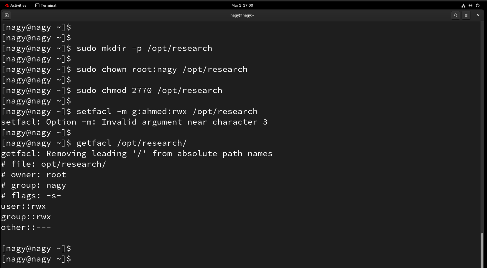
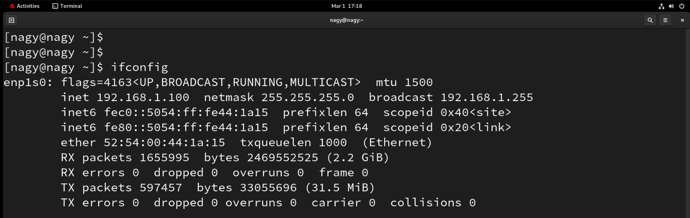
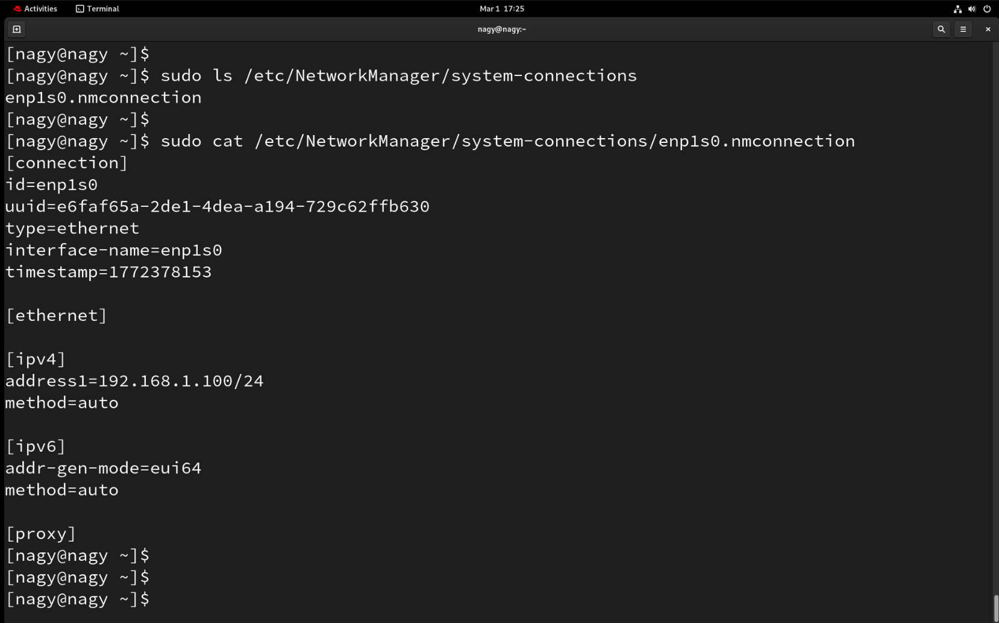
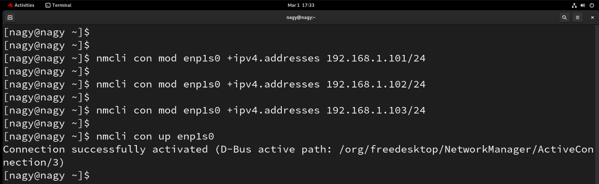

# SystemAdminII : Lab 2

## 16. Create collective directory `/opt/research` with required permissions

```bash
mkdir -p /opt/research
chown root:grads /opt/research
```

<p align="left">
  
</p>

----------------------

## 1. Display MAC address in 2 different ways

```bash
ip link show
ifconfig
```

<p align="left">
  
</p>

----------------------

## 2. Display network settings of all active interfaces

```bash
ip addr show up
```

<p align="left">
  
</p>

----------------------

## 3. Display network settings of all interfaces (active & inactive)

```bash
ip addr show
```

<p align="left">
  
</p>

----------------------

## 4. Bring your interface down


```bash
ip link set enp1s0 down
ifconfig enp1s0 down
```

<p align="left">
  
</p>

----------------------

## 5. Configure network card with static IP

```bash
nmcli con mod enp1s0 ipv4.gateway 192.168.1.1
```

<p align="left">
  
</p>

----------------------

## 6. Bring interface up

```bash
nmcli con up enp1s0
```

<p align="left">
  
</p>

----------------------

## 7. Verify using ifconfig

```bash
ifconfig
```

<p align="left">
  
</p>

----------------------

## 8. Configure network card to have dynamic IP

```bash
nmcli con mod enp1s0 ipv4.method auto
nmcli con up enp1s0
```

<p align="left">
  
</p>

----------------------

## 9. Check using ifconfig and configuration file

```bash
ifconfig
```

<p align="left">
  
</p>

<p align="left">
  
</p>


----------------------
<!-- ////////////////// -->
## 10. Reconfigure using system-config-network utility

```bash
system-config-network
```

<p align="left">
  
</p>

----------------------

## 11. Configure network card with 3 IP addresses

```bash
nmcli con mod enp1s0 +ipv4.addresses 192.168.1.101/24
nmcli con mod enp1s0 +ipv4.addresses 192.168.1.102/24
nmcli con mod enp1s0 +ipv4.addresses 192.168.1.103/24
nmcli con up enp1s0
```

<p align="left">
  
</p>

----------------------

## 12. Change hostname in global network file

```bash
vim /etc/hostname
```

<p align="left">
  
</p>

----------------------

## 13. How could you have the message only appear in the "logging server's" files

### On the Workstation (Client)

Edit rsyslog configuration:

```bash
vim /etc/rsyslog.conf
```

Add:

```bash
*.* @192.168.1.10:514
& stop
```

> Replace `192.168.1.10` with your logging server IP address.

Restart rsyslog:

```bash
systemctl restart rsyslog
```

### On the Server side

```bash
logger "Remote only test message"
```

Result:
- Appears on logging server `/var/log/messages`
- Does NOT appear on workstation `/var/log/messages`