# Containerization : Lab 1

## Problem 1

### 1. Run the container hello-world

```bash
docker run hello-world
```

<p align="left">
  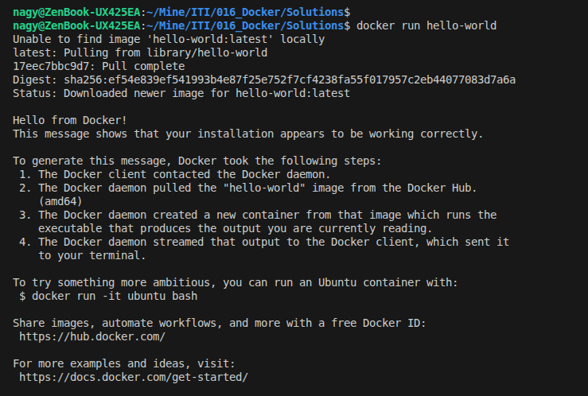
</p>


### 2. Check container status

```bash
docker ps -a
```

<p align="left">
  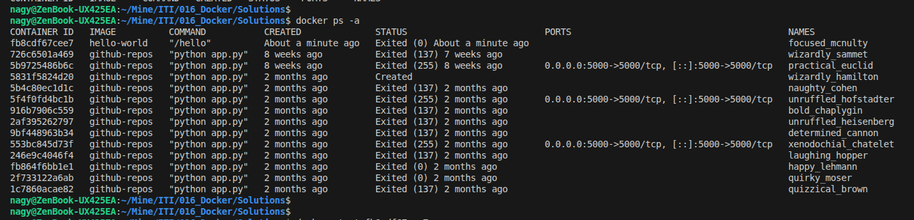
</p>

### 3. Start the stopped container

```bash
docker start fb8cdf67cee7
```

### 4. Remove the container

```bash
docker ps -a
docker rm fb8cdf67cee7
```

### 5. Remove the image

```bash
docker ps -a
docker rmi fb8cdf67cee7
```

<p align="left">
  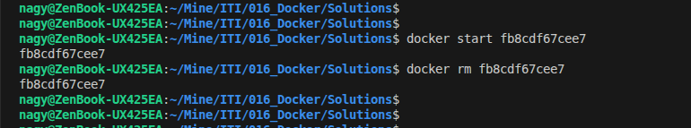
</p>

----------------------

## Problem 2

### 1. Run container centos or ubuntu in an interactive mode

```bash
docker run -it ubuntu
```

<p align="left">
  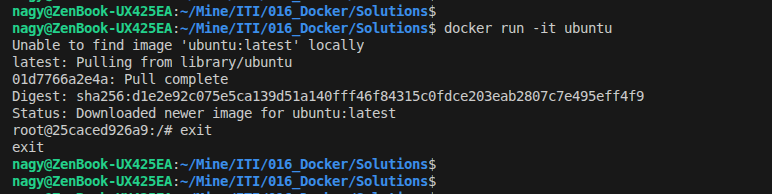
</p>

### 2. Run the following command in the container “echo docker ”

```bash
docker run ubuntu echo Hello
```

<p align="left">
  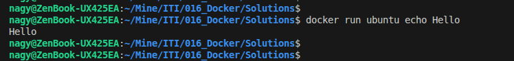
</p>


### 3. Open a bash shell in the container and touch a file named hello-docker

```bash
docker run -it ubuntu /bin/bash
touch hello.txt
```

<p align="left">
  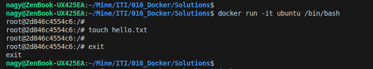
</p>

### 4. Stop the container and remove it. Write your comment about the file hello-docker

```bash
docker ps -a
docker stop 2d846c4554c6
docker rm 2d846c4554c6
```
> The file will be deleted

<p align="left">
  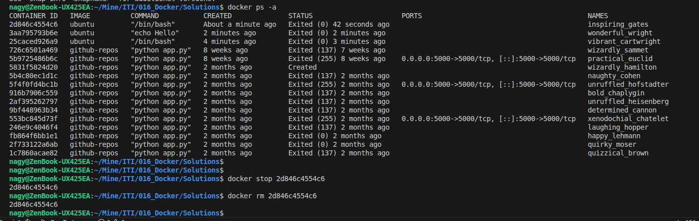
</p>

### 5. Remove all stopped containers

```bash
docker container prune
```

<p align="left">
  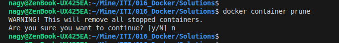
</p>

---

## Problem 3

### Deploy a MySQL database called app-database. Use the mysql latest image, and use the -e flag to set MYSQL_ROOT_PASSWORD to P4sSw0rd0!. The container should run in the background.

```bash
docker run -d --name app-database -e MYSQL_ROOT_PASSWORD=P4sSw0rd0! mysql:latest
docker ps
```

<p align="left">
  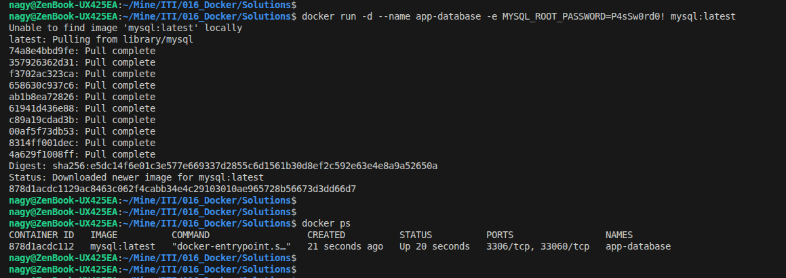
</p>

---

## Problem 4

### Run the image Nginx

```bash
docker run -it --name mynginx nginx
docker ps
```

<p align="left">
  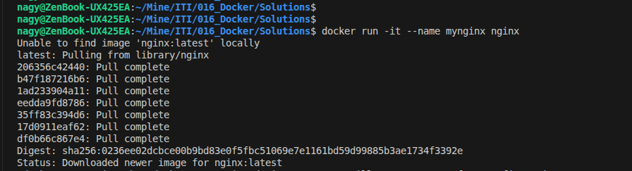
</p>

### Add html static files to the container and make sure they are accessible

```bash
docker exec -it mynginx bash
touch /usr/share/nginx/html/index.html
```

<p align="left">
  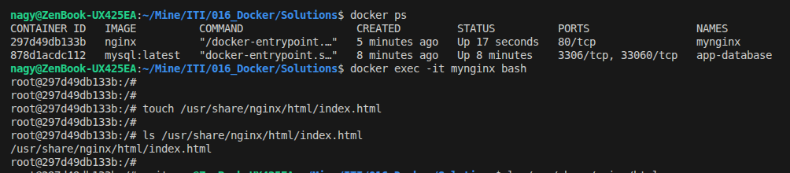
</p>

### Commit the container with image name IMAGE_NAME

```bash
docker commit mynginx
docker images
```

<p align="left">
  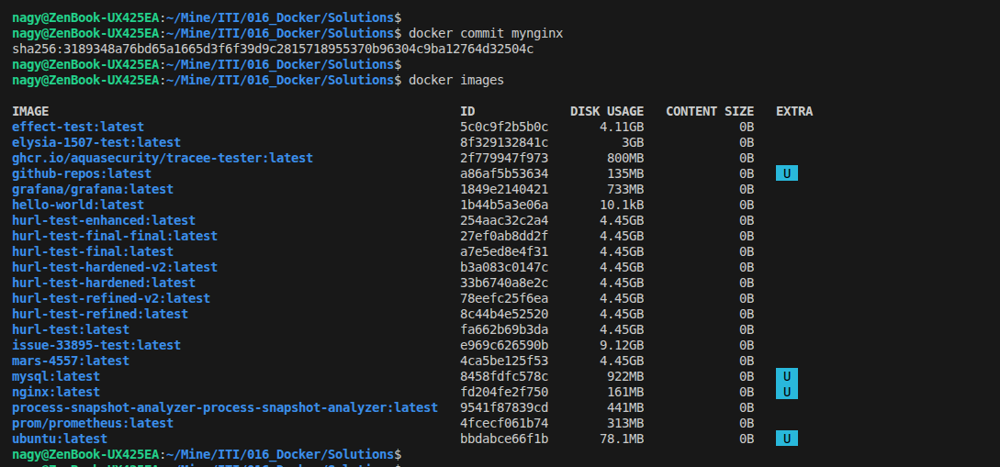
</p>

---

## Problem 5

### Run a container Nginx with name mynginx and attach a volume for containing static html file

```bash
docker run -d --name mynginx -v myvol:/usr/share/nginx/html
```

### Remove the container

```bash
docker rm -f mynginx
```

### Run a new container with the following:
- Attach the volume that was attached to the previous container
- Map port 80 to port 9898 on you host machine
- Access the html files from your browser

```bash
docker run -d --name mynginx -v myvol:/usr/share/nginx/html -p 9898:80 nginx
curl localhost:9898
```

<p align="left">
  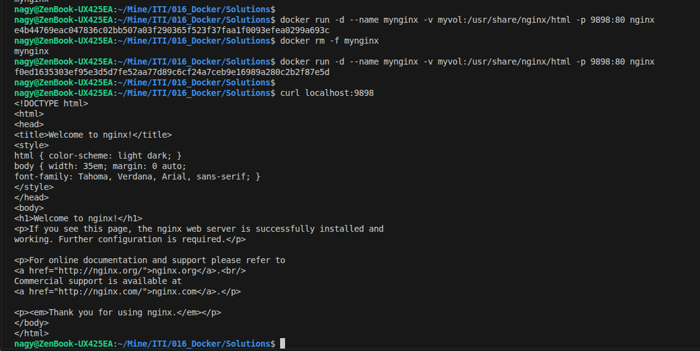
</p>


