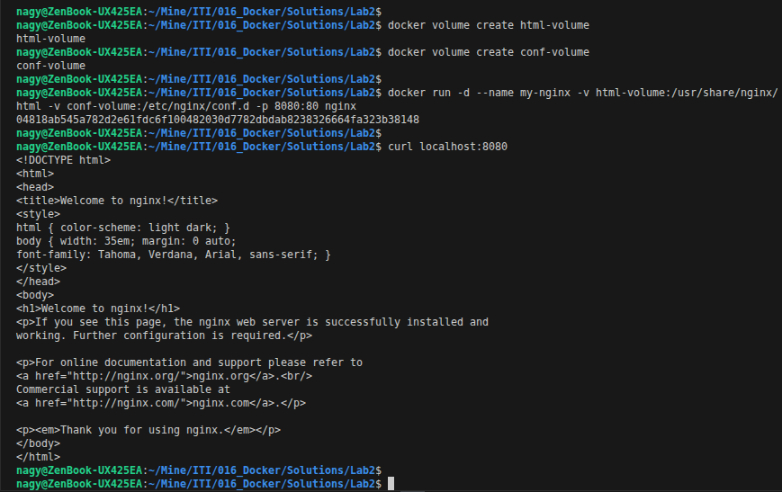
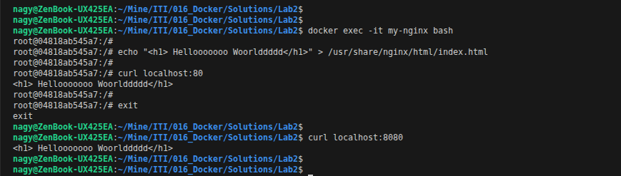
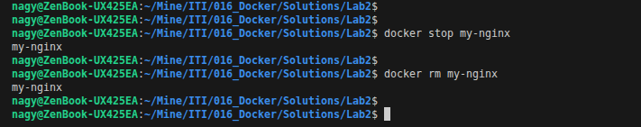
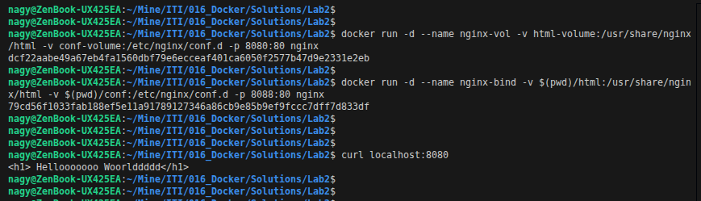
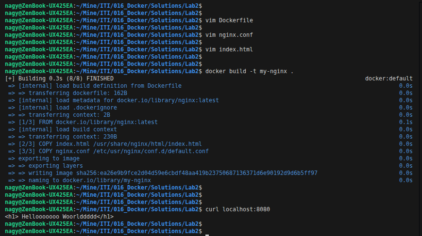
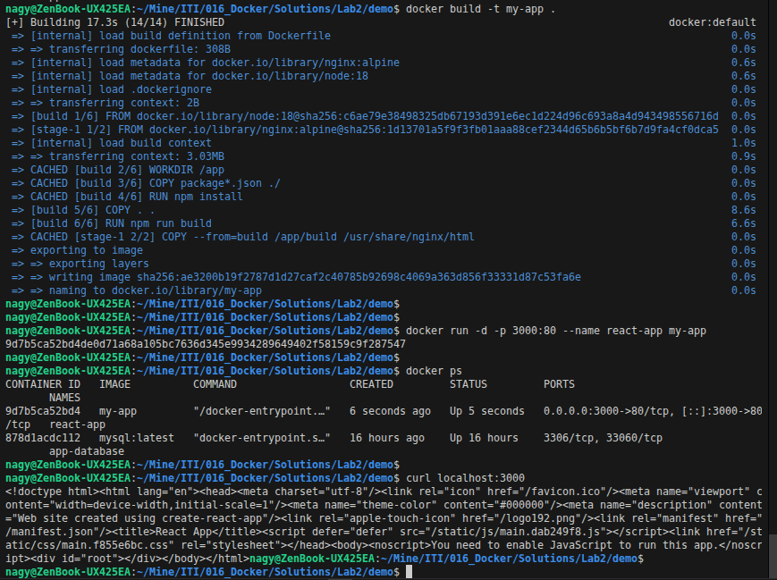
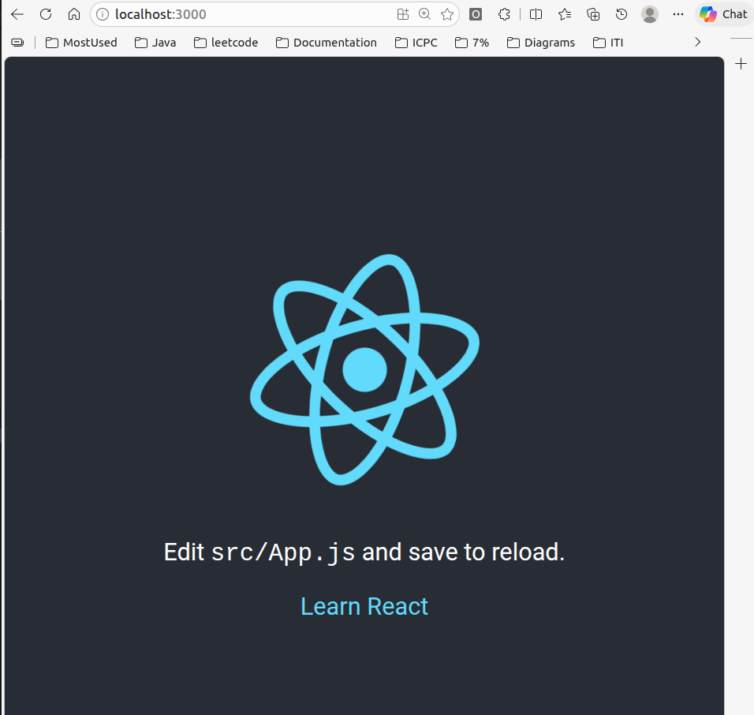

# Lab2 : docker

## Problem 1

### Run a container nginx with name my-nginx and attach a and attach a volume 2 volumes to the container
- Volume1 for containing static html file
- Volume2 for containing nginx configuration

```bash
docker volume create html-volume
docker volume create conf-volume
docker run -d --name my-nginx -v html-volume:/usr/share/nginx/html -v conf-volume:/etc/nginx/conf.d -p 8080:80 nginx
curl localhost:8080
```

<p align="left">
  
</p>

### Edit the html content

```bash
docker exec -it my-nginx bash
echo "<h1> Hellooooooo Woorlddddd</h1>" > /usr/share/nginx/html/index.html
curl localhost:8080
```

<p align="left">
  
</p>

### Remove the container

```bash
docker stop my-nginx
docker rm my-nginx
```

<p align="left">
  
</p>

### Run a new 2 containers with the following:
- Attach the 2 volumes that was attached to the previous container in two different ways (volume mount bind mount)
- Map port 80 to port 8080 on you host machine
- Access the html files from your browser

```bash
docker run -d --name nginx-vol -v html-volume:/usr/share/nginx/html -v conf-volume:/etc/nginx/conf.d -p 8080:80 nginx
docker run -d --name nginx-bind -v $(pwd)/html:/usr/share/nginx/html -v $(pwd)/conf:/etc/nginx/conf.d -p 8088:80 nginx
curl localhost:8080
```

<p align="left">
  
</p>

## Problem 2

### Create a dockerfile for nginx image with different html content and different nginx conf that listen to port 8080 instead of port 80 on the container

```bash
vim Dockerfile
vim nginx.conf
vim index.html
docker build -t my-nginx .
curl localhost:8080
```

```Dockerfile
FROM nginx

COPY index.html /usr/share/nginx/html/index.html
COPY nginx.conf /etc/usr/nginx/conf.d/default.conf

EXPOSE 8080
```

<p align="left">
  
</p>

## Problem 3

### Create a reactjs simple app

```bash
npx create-react-app demo
cd demo
```

### Create a dockerfile to containerize the reactapp

```bash
vim Dockerfile
```

```Dockerfile
# Stage 1: Build React app
FROM node:18 AS build
WORKDIR /app
COPY package*.json ./
RUN npm install
COPY . .
RUN npm run build

# Stage 2: Serve with nginx
FROM nginx:alpine
COPY --from=build /app/build /usr/share/nginx/html
EXPOSE 80
CMD ["nginx", "-g", "daemon off;"]
```

### Build the image and test it

```bash
docker build -t my-app .
docker run -d -p 3000:80 --name react-app my-app
curl localhost:3000
```
<p align="left">
  
</p>

<p align="left">
  
</p>
