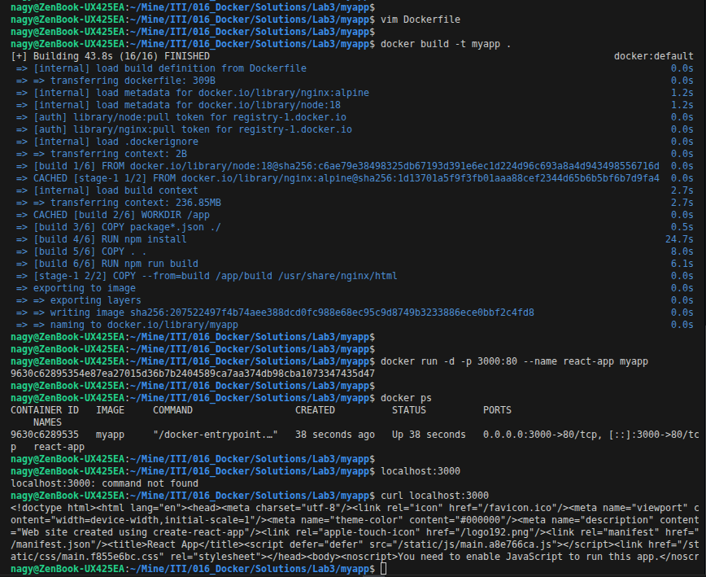
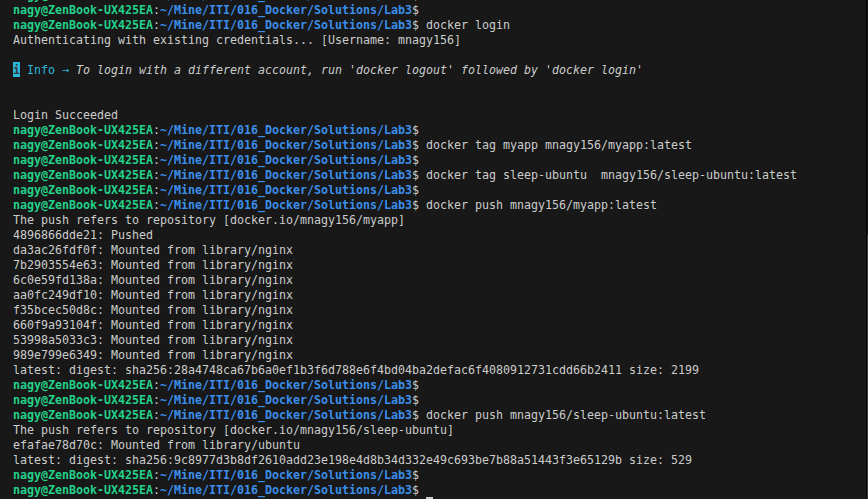
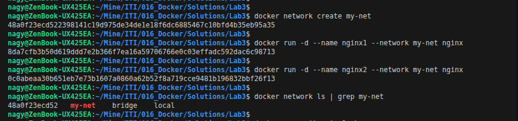
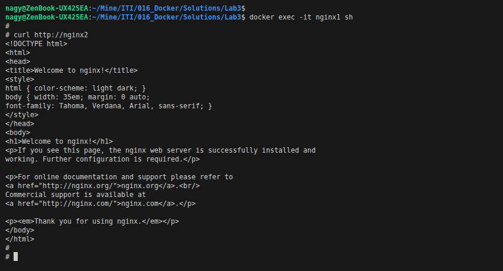

# Lab3 : Docker

## Problem 1

### Create a reactjs simple app

```bash
npx create-react-app myapp
cd myapp
```

### Create a dockerfile to containerize the reactapp

```Dockerfile
# Stage 1: Build React app
FROM node:18 AS build
WORKDIR /app
COPY package*.json ./
RUN npm install
COPY . .
RUN npm run build

# Stage 2: Serve with nginx
FROM nginx:alpine
COPY --from=build /app/build /usr/share/nginx/html
EXPOSE 80
CMD ["nginx", "-g", "daemon off;"]
```

### Build the image and test it

```bash
docker build -t myapp .
docker run -d -p 3000:80 --name react-app myapp
curl localhost:3000
```

<p align="left">
  
</p>

## Problem 2

### Create a dockerfile for ubuntu image which sleeps by default for 5 sec or sleeps according to the given number in the docker command

```Dockerfile
FROM ubuntu:latest
CMD ["sh", "-c", "sleep ${SLEEP_TIME:-5}"]
```

<p align="left">
  
</p>

## Problem 3

### Push the images created in Problem 1&2 into your docker hub repo

```Dockerfile
docker login
docker tag myapp mnagy156/myapp:latest
docker tag sleep-ubuntu  mnagy156/sleep-ubuntu:latest
docker push mnagy156/myapp:latest
docker push mnagy156/sleep-ubuntu:latest
```

<p align="left">
  
</p>

## Problem 4

### Create 2 nginx containers with network type bridge, enter to one of them and use curl command to view the content of the other container.

```bash
docker network create my-net
docker run -d --name nginx1 --network my-net nginx
docker run -d --name nginx2 --network my-net nginx
docker network ls | grep my-net
docker exec -it nginx1 sh
curl http://nginx2
```

<p align="left">
  
</p>

<p align="left">
  
</p>