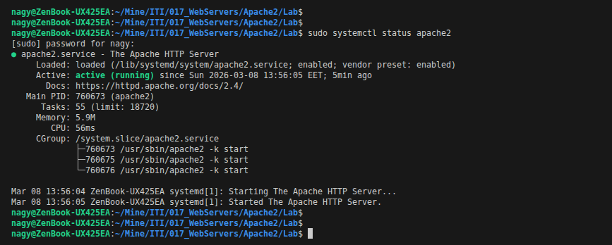
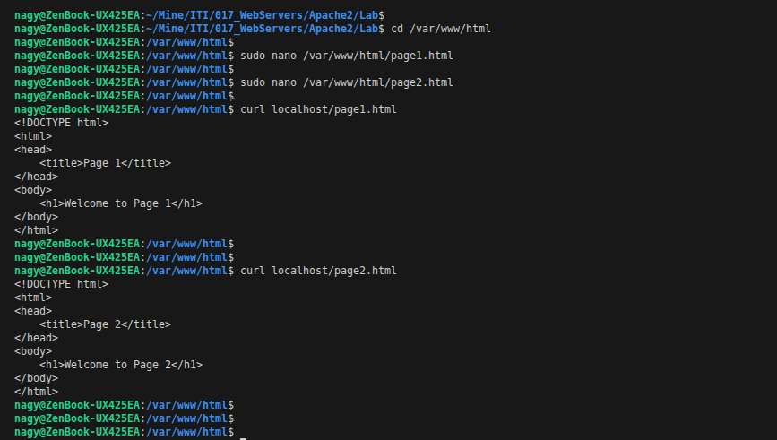
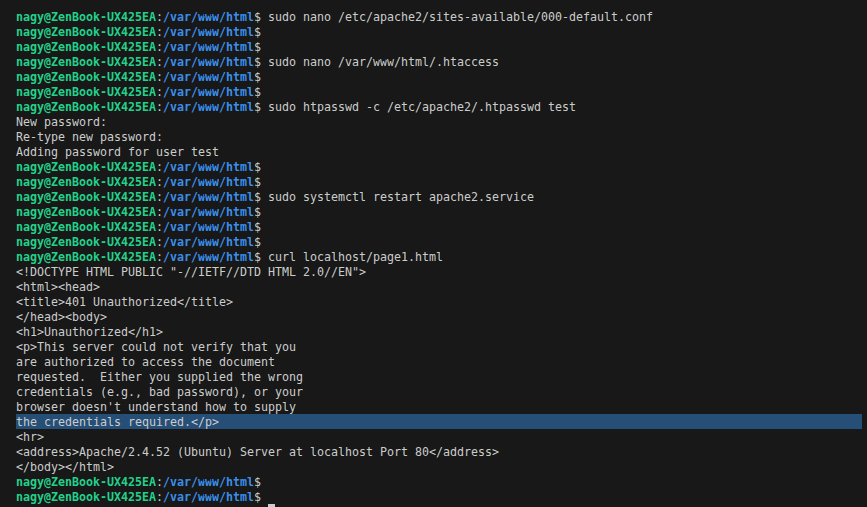
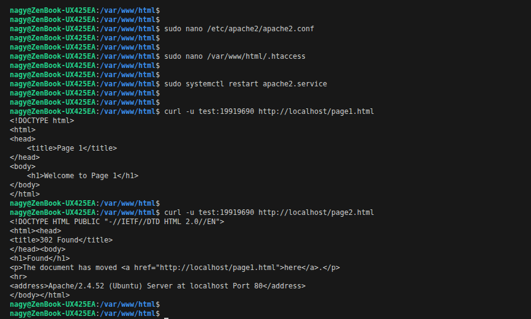
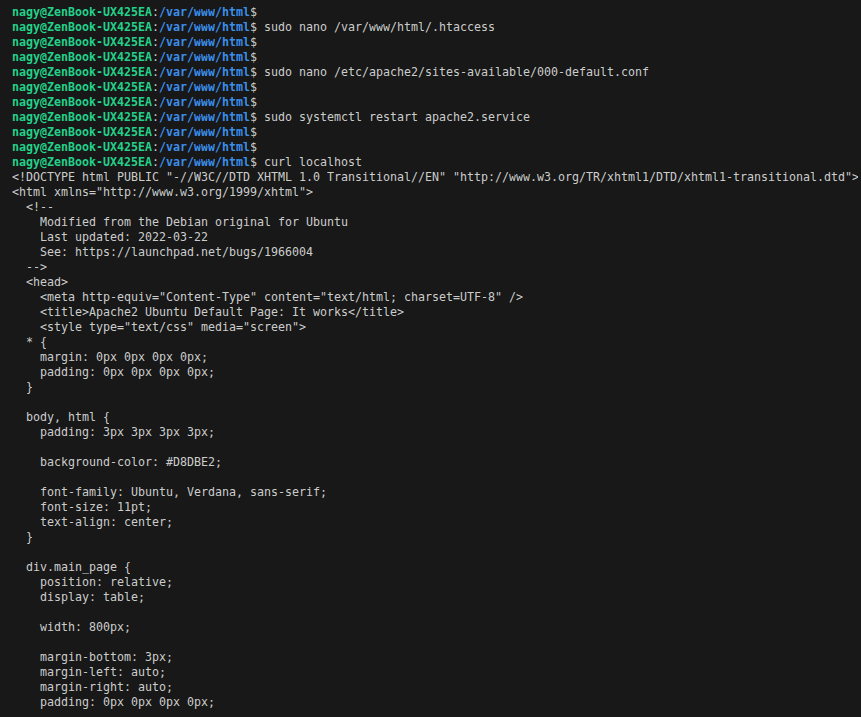
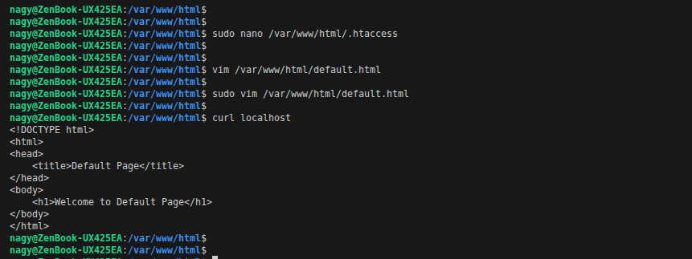

# Lab1 : Apache Web Server

## Install Apache HTTP server

  

## Create two simple html pages named “page1.html, page2.html” then use the suitable directive to automatically redirect from localhost/page1.html to localhost/page2.html.

  

## Ask for username and password when accessing a directory.

  

## Create a directory then allow access to one of your classmates only.

  

## Disable listing the directory content (hint use indexes)

  

## Change the default index page to be default.html instead of index.html

  

