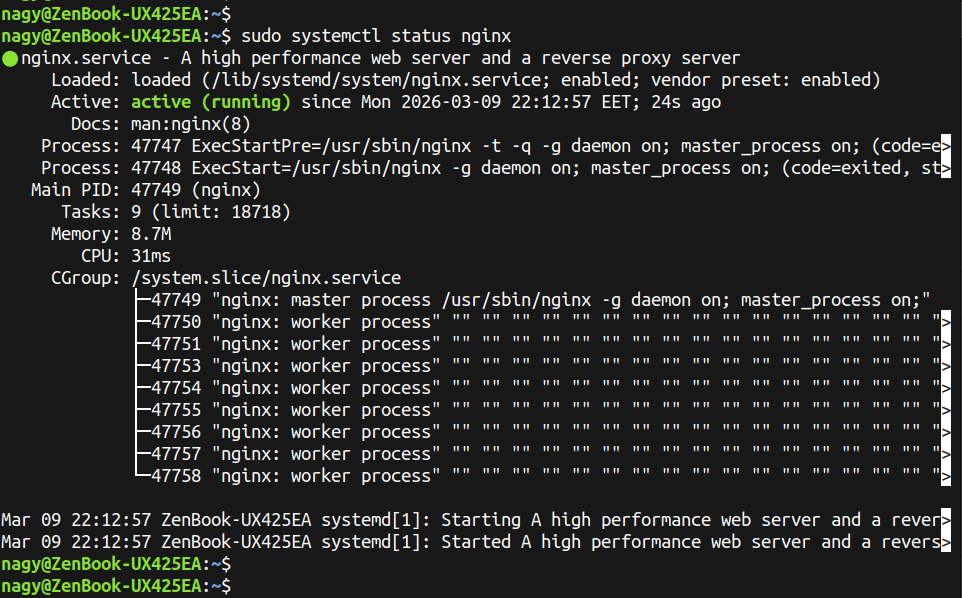
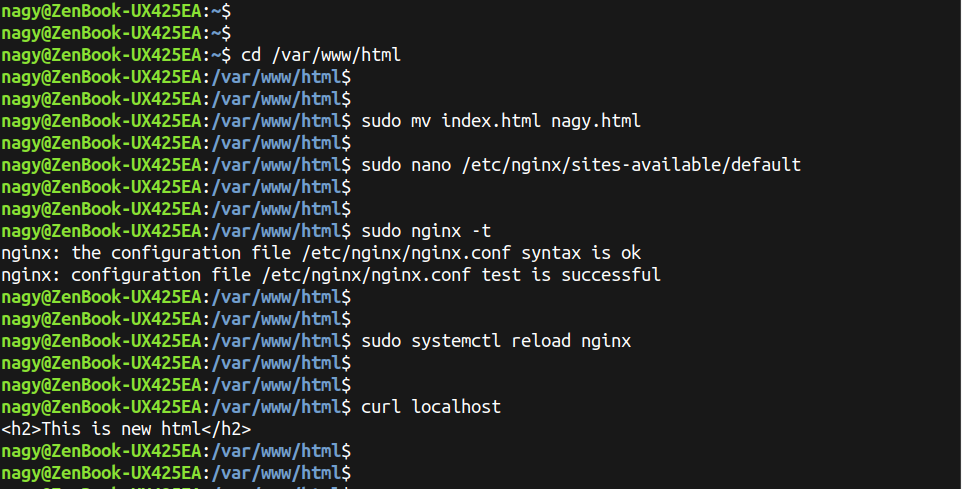
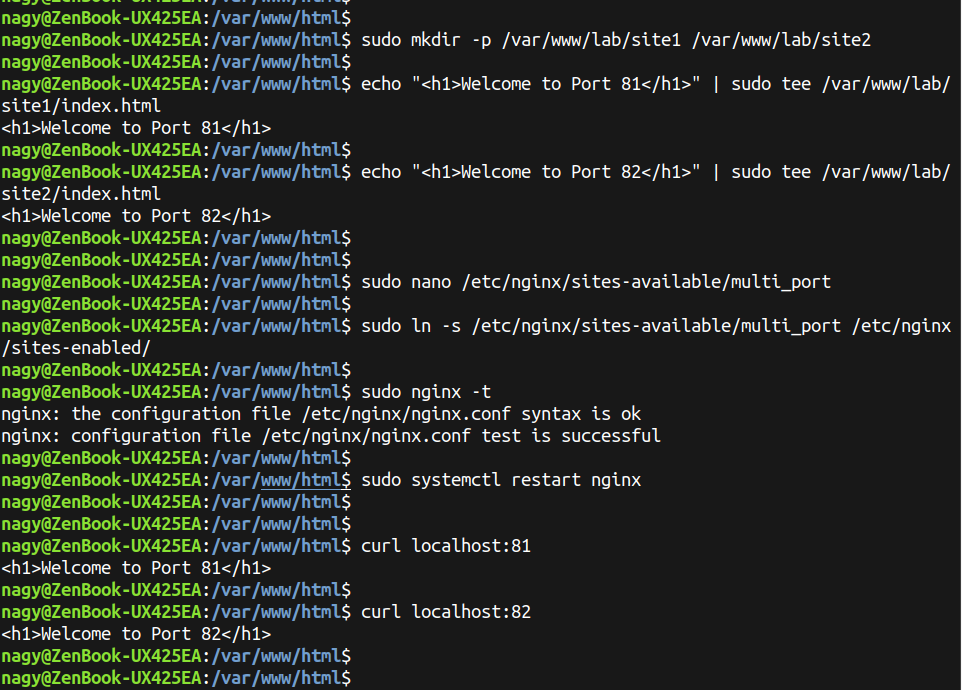

# Lab2 : Nginx Web Server

## Question 1: Install Nginx

```bash
sudo apt update
sudo apt install nginx -y
sudo systemctl status nginx
```

<p align="left">
  
</p>

---

## Question 2: Change the default file (index.html) to (yourName.html)

```bash
cd /var/www/html
sudo mv index.html john.html
sudo nano /etc/nginx/sites-available/default
sudo nginx -t
sudo systemctl reload nginx
```

<p align="left">
  
</p>

---

## Question 3: Make two html files, and change the configuration file to access the first file on port 81, and access the second file on port 82.

```bash
sudo mkdir -p /var/www/lab/site1 /var/www/lab/site2
echo "<h1>Welcome to Port 81</h1>" | sudo tee /var/www/lab/site1/index.html
echo "<h1>Welcome to Port 82</h1>" | sudo tee /var/www/lab/site2/index.html
sudo nano /etc/nginx/sites-available/multi_port
sudo ln -s /etc/nginx/sites-available/multi_port /etc/nginx/sites-enabled/
sudo nginx -t
sudo systemctl restart nginx
```

<p align="left">
  
</p>

---

## Question 4: Main differences between Apache & Nginx

| Feature | Apache | Nginx |
| :--- | :--- | :--- |
| **Architecture** | Process-based (creates a new thread for every request). | Event-driven (Asynchronous, handles multiple connections in one thread). |
| **Performance** | Slower under heavy loads due to high RAM consumption. | High performance and stability under heavy concurrent loads. |
| **Static Content** | Good, but slightly slower than Nginx. | Excellent at serving static files (much faster). |
| **Dynamic Content** | Handles dynamic content within the server (via modules). | Requires an external processor (like PHP-FPM) to handle dynamic content. |
| **Configuration** | Allows directory-level configuration via `.htaccess` files. | Centralized configuration only (better for performance). |
