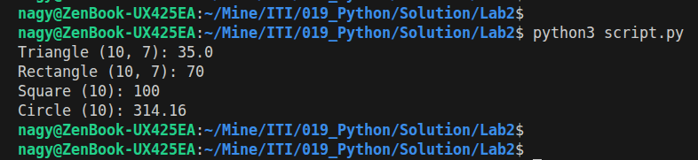
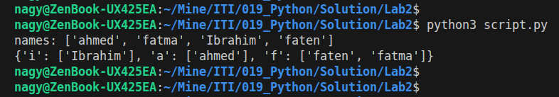
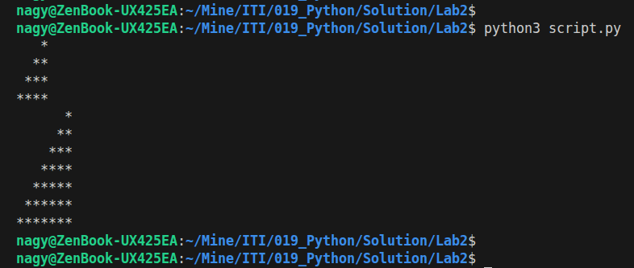

# Lab2 : Python

## Calculate Area Function.

```python
def calc_area(shape, s1, s2=None):
    shape = shape.lower()
    if shape == 't':
        return 0.5 * s1 * s2
    elif shape == 'r':
        if s2 == None:
            return s1 * s1
        else:
            return s1 * s2
    elif shape == 'c':
        return math.pi * (s1 ** 2)
```

<p align="left">
  
</p>


## Name List to Dictionary.

```python
def names_to_dict(names_list):
    names_list.sort()
    res = {}
    for name in names_list:
        key = name[0].lower()
        if key not in res:
            res[key] = []
        res[key].append(name)
    return res
```

<p align="left">
  
</p>


## Mario Pyramid.

```python
def mario_pyramid(height):
    for i in range(1, height + 1):
        spaces = " " * (height - i)
        stars = "*" * i
        print(f"{spaces}{stars}")
```

<p align="left">
  
</p>
