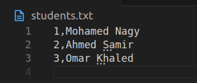
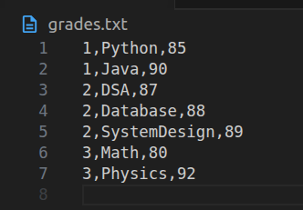
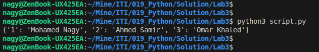
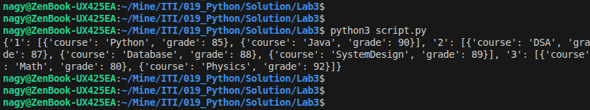
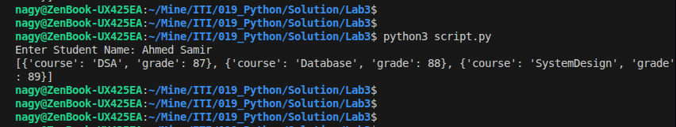
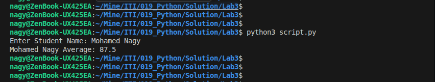

# Lab3 : Python

## Task 1
- Create a Python script that generates the following files:
    - students.txt
    - grades.txt
- Each file should contain properly formatted data.

```python
def create_students_data():
    students = open("students.txt", "w")
    students.write("1,Mohamed Nagy\n")
    students.write("2,Ahmed Samir\n")
    students.write("3,Omar Khaled\n")
    students.close()
```

```python
def create_grades_data():
    grades = open("grades.txt", "w")
    grades.write("1,Python,85\n")
    grades.write("1,Java,90\n")
    
    grades.write("2,DSA,87\n")
    grades.write("2,Database,88\n")
    grades.write("2,SystemDesign,89\n")
    
    grades.write("3,Math,80\n")
    grades.write("3,Physics,92\n")
    
    grades.close()
```

<p align="left">
  
</p>
<p align="left">
  
</p>


## Task 2
- Read the students.txt file and display all student names.

```python
studentsData = {}
def read_students():
    students = open("students.txt", "r")
    for line in students:
        parts = line.strip().split(",")
        studentsData[parts[0]] = parts[1]
    students.close()
```

<p align="left">
  
</p>


## Task 3
- Read the grades.txt file and display all grades for the Python subject only.

```python
gradesData = {}
def read_grades():
    grades = open("grades.txt", "r")
    for line in grades:
        id, course, grade = line.strip().split(",")

        if id not in gradesData:
            gradesData[id] = []

        gradesData[id].append({
            "course": course,
            "grade": int(grade)
        })
    grades.close()
```

<p align="left">
  
</p>


## Task 4
- Ask the user to enter a student_id, then display:
    - Student name
    - All subjects and corresponding grades

```python
def find_id_by_name(name):
    for id, student_name in studentsData.items():
        if student_name == name:
            return id
    return None


def user_prompt():
    name = input("Enter Student Name: ")
    id = find_id_by_name(name)
    if id is None:
        print("Name is not presented.")
    else:
        print(gradesData.get(id))
```

<p align="left">
  
</p>


## Task 5
- Calculate and display the average grade for each student.

```python
def get_student_avg():
    name = input("Enter Student Name: ")
    id = find_id_by_name(name)
    if id is None:
        print("Name is not presented.")
    else:
        avg = get_avg_for_student(id)
        print(f"{name} Average: {avg}")


def get_avg_for_student(student_id):
    grades = gradesData.get(student_id, [])

    if not grades:
        return 0

    total = 0
    for g in grades:
        total += g["grade"]
    return total / len(grades)
```

<p align="left">
  
</p>