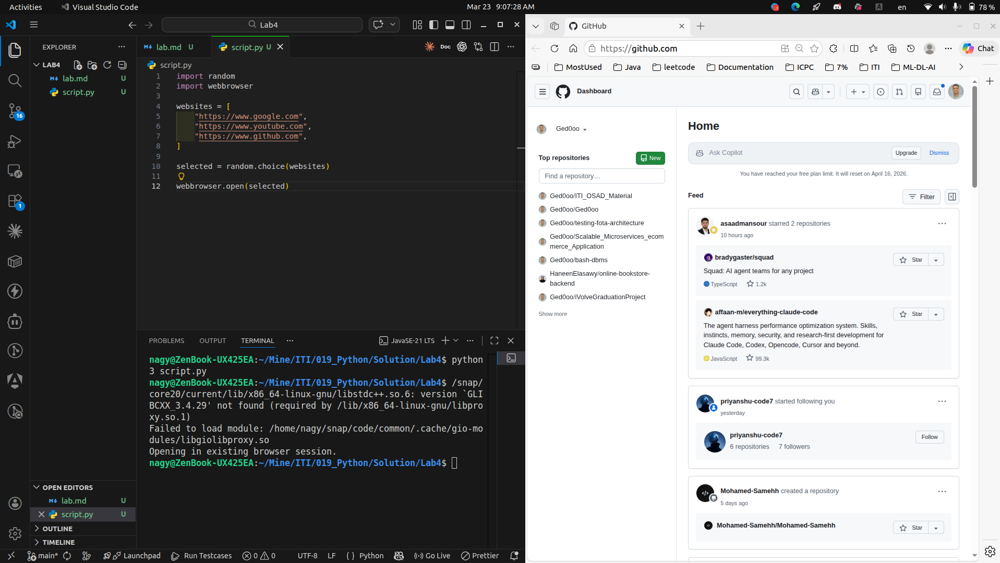
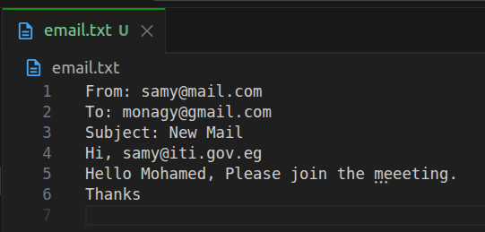
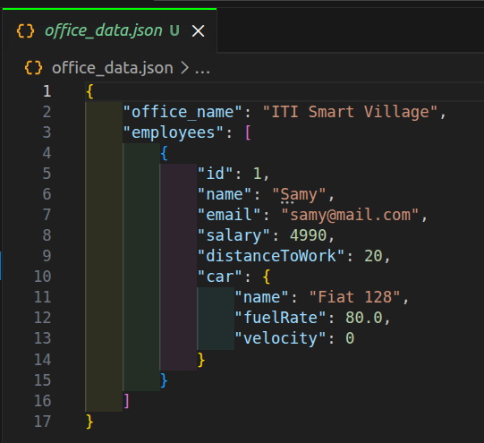

# Lab4 : Python

## Task 1

- Write a program that choose a random website name from list and open it in your browser :

```python
import random
import webbrowser
websites = [
    "https://www.google.com",
    "https://www.youtube.com",
    "https://www.github.com",
]
selected = random.choice(websites)
webbrowser.open(selected)
```

<p align="left">
  
</p>


## Task 2

- Samy is an Employee, He works in ITI and He has a car. He goes everyday except weekends to ITI Smart Village Office by his fiat 128 car

### Person

```python
class Person:
    moods = ("happy", "tired", "lazy")

    def __init__(self, name, money=0, mood="happy", healthRate=100):
        self.name = name
        self.money = money
        self.mood = mood
        self.healthRate = max(0, min(healthRate, 100))

    def sleep(self, hours):
        if hours == 7:
            self.mood = "happy"
        elif hours < 7:
            self.mood = "tired"
        else:
            self.mood = "lazy"

    def eat(self, meals):
        if meals == 3:
            self.healthRate = 100
        elif meals == 2:
            self.healthRate = 75
        elif meals == 1:
            self.healthRate = 50

    def buy(self, items):
        self.money -= items * 10
```

### Employee

```python
from person import Person

class Employee(Person):
    def __init__(self, id, name, car, email, salary, distanceToWork, money=0, mood="happy", healthRate=100):
        super().__init__(name, money, mood, healthRate)

        self.id = id
        self.car = car
        self.distanceToWork = distanceToWork
        self.email = email
        self.salary = max(salary, 1000)

    def work(self, hours):
        if hours == 8:
            self.mood = "happy"
        elif hours > 8:
            self.mood = "tired"
        else:
            self.mood = "lazy"

    def drive(self, velocity):
        self.car.run(velocity, self.distanceToWork)

    def refuel(self, gasAmount=100):
        self.car.fuelRate = min(100, self.car.fuelRate + gasAmount)

    def send_mail(self, to, subject, msg, receiver_name):
        filename = "email.txt"
        with open(filename, "w") as f:
            f.write(f"From: {self.email}\n")
            f.write(f"To: {to}\n")
            f.write(f"Subject: {subject}\n")
            f.write(f"Hi, {receiver_name}\n")
            f.write(f"{msg}\n")
            f.write("Thanks\n")
```

### Car

```python
class Car:
    def __init__(self, name, fuelRate=100, velocity=0):
        self.name = name
        self.fuelRate = max(0, min(fuelRate, 100))
        self.velocity = max(0, min(velocity, 200))

    def run(self, velocity, distance):
        self.velocity = max(0, min(velocity, 200))

        fuel_consumption = (distance / 10) * 10
        if fuel_consumption > self.fuelRate:
            max_distance = (self.fuelRate / 10) * 10
            self.fuelRate = 0
            self.stop(max_distance - distance)
        else:
            self.fuelRate -= fuel_consumption
            self.stop(0)

    def stop(self, remaining_distance):
        self.velocity = 0
        if remaining_distance > 0:
            print(f"Stopped, Remaining distance: {remaining_distance} km")
        else:
            print("Arrived")
```


### Office

```python
class Office:
    employeesNum = 0

    def __init__(self, name):
        self.name = name
        self.employees = []

    def get_all_employees(self):
        return self.employees

    def get_employee(self, empId):
        for emp in self.employees:
            if emp.id == empId:
                return emp
        return None

    def hire(self, employee):
        self.employees.append(employee)
        Office.employeesNum += 1

    def fire(self, empId):
        self.employees = [emp for emp in self.employees if emp.id != empId]
        Office.employeesNum -= 1

    def deduct(self, empId, deduction):
        emp = self.get_employee(empId)
        if emp:
            emp.salary -= deduction

    def reward(self, empId, reward):
        emp = self.get_employee(empId)
        if emp:
            emp.salary += reward

    def check_lateness(self, empId, moveHour):
        emp = self.get_employee(empId)
        if emp:
            is_late = Office.calculate_lateness(9, moveHour, emp.distanceToWork, emp.car.velocity)
            if is_late:
                self.deduct(empId, 10)
                print("Late! Salary deducted.")
            else:
                self.reward(empId, 10)
                print("On time! Reward added.")

    @staticmethod
    def calculate_lateness(targetHour, moveHour, distance, velocity):
        if velocity == 0:
            return True
        time = distance / velocity
        arrival = moveHour + time
        return arrival > targetHour

    @classmethod
    def change_emps_num(cls, num):
        cls.employeesNum = num
```


### Persistance

```python
import json

def save_to_json(office):
    data = {
        "office_name": office.name,
        "employees": []
    }

    for emp in office.employees:
        data["employees"].append({
            "id": emp.id,
            "name": emp.name,
            "email": emp.email,
            "salary": emp.salary,
            "distanceToWork": emp.distanceToWork,
            "car": {
                "name": emp.car.name,
                "fuelRate": emp.car.fuelRate,
                "velocity": emp.car.velocity
            }
        })

    with open("office_data.json", "w") as f:
        json.dump(data, f, indent=4)
```

<p align="left">
  
</p>

<p align="left">
  
</p>