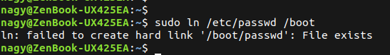
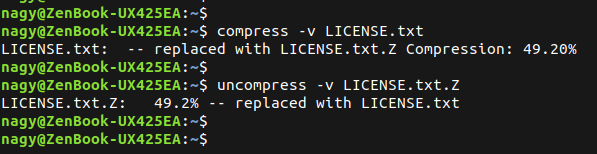
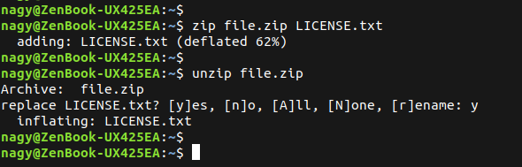
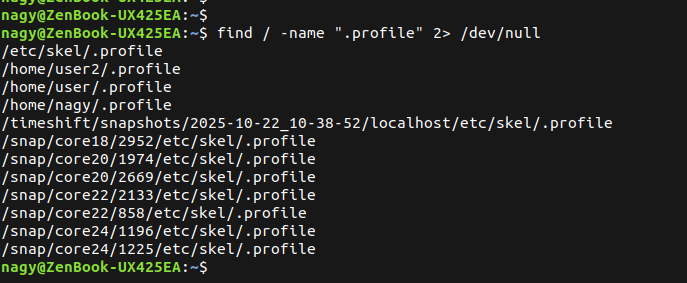
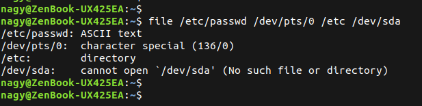
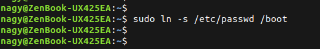
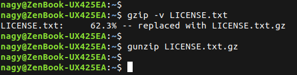

## 1. List the user commands and redirect the output to /tmp/commands.
```bash
sudo ls /usr/bin/ >> /tmp/commands
```
<p align="center">
  
</p>

----------------------


## 2. Count the number of user commands
```bash
wc -l /tmp/commands
```
<p align="center">
  
</p>

----------------------


## 3. Get all the users names whose first character in their login is ‘g’.
```bash
cat /etc/passwd | cut -f1 -d: | grep ^g
```
<p align="center">
  
</p>

----------------------


## 4. Get the logins name and full names (comment) of logins starts with “g”.
```bash
cat /etc/passwd | cut -f15 -d:  | grep ^g
```
<p align="center">
  
</p>

----------------------


## 5. Save the output of the last command sorted by their full names in a file.
```bash
cat /etc/passwd | cut -f1 -d: | grep ^g | sort -t : -k1
```
<p align="center">
  
</p>

----------------------


## 7. Display the number of users who is logged now to the system.
```bash
w | wc -l 
```
<p align="center">
  
</p>

----------------------


## 8. Display lines 7 to line 10 of /etc/passwd file
```bash
cat /etc/passwd | head -10 | tail -7
```
<p align="center">
  
</p>

----------------------


## 9. What happens if you execute:
* cat filename1 | cat filename2
```text
it executes the first cmd "cat" then pass the file output as an input to the next cat which is useless, because it have already input file
```

* ls | rm
```text
it ignores it because it needs the bachtec ``
```

* ls /etc/passwd | wc -l 
1


----------------------


## 10.Issue the command sleep 100.
```text
it waits for 100 seconds so the cpu will be holded
```
<p align="center">
  
</p>


----------------------


## 11.Stop the last command.
```bash
sudo kill -STOP 119365
```
<p align="center">
  
</p>

----------------------


## 12.Resume the last command in the background
```bash
sudo kill -CONT 119365
```
<p align="center">
  
</p>


----------------------


## 13.Issue the jobs command and see its output. 
```bash
jobs
```


----------------------


## 14.Send the sleep command to the foreground and send it again to the background.
```bash
nagy@ZenBook-UX425EA:~$ fg %1
sleep 100
^Z
[1]+  Stopped                 sleep 100
```


----------------------


## 15.Kill the sleep command.
```bash
sudo kill -9 120339
```


----------------------


## 16.Display your processes only
```bash
ps -u $USER
```


----------------------


## 17.Display all processes except yours
```bash
pgrep -v -u $USER
```


----------------------


## 18.Use the pgrep command to list your processes only
```bash
pgrep -u $USER
```


----------------------


## 19.Kill your processes only.
```bash
pkill -u $USER
```


----------------------