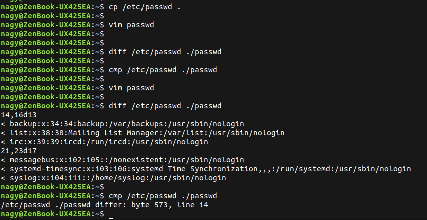

## 1. Compress a file by compress, gzip, zip commands and decompress it again. State the differences between compress and gzip commands.

```bash
nagy@ZenBook-UX425EA:~$ gzip -v LICENSE.txt 
LICENSE.txt:	 62.3% -- replaced with LICENSE.txt.gz
nagy@ZenBook-UX425EA:~$ 
nagy@ZenBook-UX425EA:~$ gunzip LICENSE.txt.gz 
nagy@ZenBook-UX425EA:~$ 
nagy@ZenBook-UX425EA:~$ compress -v LICENSE.txt 
LICENSE.txt:  -- replaced with LICENSE.txt.Z Compression: 49.20%
nagy@ZenBook-UX425EA:~$ 
nagy@ZenBook-UX425EA:~$ uncompress -v LICENSE.txt.Z 
LICENSE.txt.Z:	 49.2% -- replaced with LICENSE.txt
nagy@ZenBook-UX425EA:~$ 
nagy@ZenBook-UX425EA:~$ zip file.zip LICENSE.txt 
  adding: LICENSE.txt (deflated 62%)
nagy@ZenBook-UX425EA:~$ 
nagy@ZenBook-UX425EA:~$ unzip file.zip 
Archive:  file.zip
replace LICENSE.txt? [y]es, [n]o, [A]ll, [N]one, [r]ename: y
  inflating: LICENSE.txt             
nagy@ZenBook-UX425EA:~$ 
```
<p align="left">
  
</p>

<p align="left">
  
</p>

<p align="left">
  
</p>


----------------------


## 2. What is the  command used to view the content of a compressed file.

```bash
nagy@ZenBook-UX425EA:~$ gzip -v LICENSE.txt 
LICENSE.txt:	 62.3% -- replaced with LICENSE.txt.gz
nagy@ZenBook-UX425EA:~$ 
nagy@ZenBook-UX425EA:~$ zcat LICENSE.txt.gz 
```


----------------------


## 3. Backup /etc directory using tar utility.

```bash
nagy@ZenBook-UX425EA:~$ tar -cvf myetc.tar /etc 2> /dev/null
```

----------------------


## 4. Starting from your home directory, find all files that were modified in the last two day.

```bash
nagy@ZenBook-UX425EA:~$ find ~ -mtime -2
```


----------------------


## 5. Starting from /etc, find files owned by root user.

```bash
nagy@ZenBook-UX425EA:~$ find /etc -user root
```


----------------------


## 6. Find all directories in your home directory.

```bash
nagy@ZenBook-UX425EA:~$ find ~ -type d
```


----------------------


## 7. Write a command to search for all files on the system that, its name is “.profile”. 

```bash
nagy@ZenBook-UX425EA:~$ find / -name ".profile" 2> /dev/null
```
<p align="left">
  
</p>


----------------------


## 8. Identify the file types of the following: /etc/passwd, /dev/pts/0, /etc, /dev/sda

```bash
nagy@ZenBook-UX425EA:~$ file /etc/passwd /dev/pts/0 /etc /dev/sda
/etc/passwd: ASCII text
/dev/pts/0:  character special (136/0)
/etc:        directory
/dev/sda:    cannot open `/dev/sda' (No such file or directory)
nagy@ZenBook-UX425EA:~$ 
```
<p align="left">
  
</p>


----------------------


## 9. List the inode numbers of /, /etc, /etc/hosts.

```bash
nagy@ZenBook-UX425EA:~$ ls -i / /etc /etc/hosts
```


----------------------


## 10. Copy /etc/passwd to your home directory, use the commands diff and cmp, and Edit in the file you copied, and then use these commands again, and check the output.

```bash
nagy@ZenBook-UX425EA:~$ cp /etc/passwd .
nagy@ZenBook-UX425EA:~$ 
nagy@ZenBook-UX425EA:~$ vim passwd 
nagy@ZenBook-UX425EA:~$ 
nagy@ZenBook-UX425EA:~$ diff /etc/passwd ./passwd 
nagy@ZenBook-UX425EA:~$ 
nagy@ZenBook-UX425EA:~$ cmp /etc/passwd ./passwd 
nagy@ZenBook-UX425EA:~$ 
nagy@ZenBook-UX425EA:~$ vim passwd 
nagy@ZenBook-UX425EA:~$ 
nagy@ZenBook-UX425EA:~$ diff /etc/passwd ./passwd 
14,16d13
< backup:x:34:34:backup:/var/backups:/usr/sbin/nologin
< list:x:38:38:Mailing List Manager:/var/list:/usr/sbin/nologin
< irc:x:39:39:ircd:/run/ircd:/usr/sbin/nologin
21,23d17
< messagebus:x:102:105::/nonexistent:/usr/sbin/nologin
< systemd-timesync:x:103:106:systemd Time Synchronization,,,:/run/systemd:/usr/sbin/nologin
< syslog:x:104:111::/home/syslog:/usr/sbin/nologin
nagy@ZenBook-UX425EA:~$ 
nagy@ZenBook-UX425EA:~$ cmp /etc/passwd ./passwd 
/etc/passwd ./passwd differ: byte 573, line 14
nagy@ZenBook-UX425EA:~$ 
```
<p align="left">
  
</p>


----------------------


## 11. Create a symbolic link of /etc/passwd in /boot.

```bash
nagy@ZenBook-UX425EA:~$ sudo ln -s /etc/passwd /boot
```
<p align="left">
  
</p>


----------------------


## 12. Create a hard link of /etc/passwd in /boot. Could you? Why? LAB5
```bash
nagy@ZenBook-UX425EA:~$ 
nagy@ZenBook-UX425EA:~$ sudo ln /etc/passwd /boot
ln: failed to create hard link '/boot/passwd': File exists
nagy@ZenBook-UX425EA:~$ 
nagy@ZenBook-UX425EA:~$ 
```

* Normally No, because /etc and /boot are often on different filesystems.

<p align="left">
  
</p>


