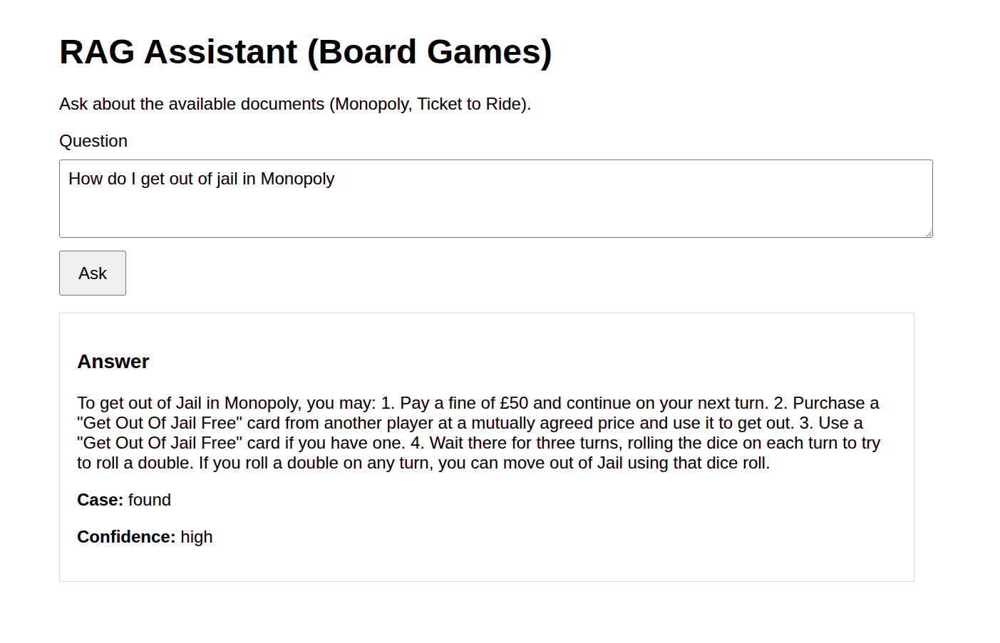
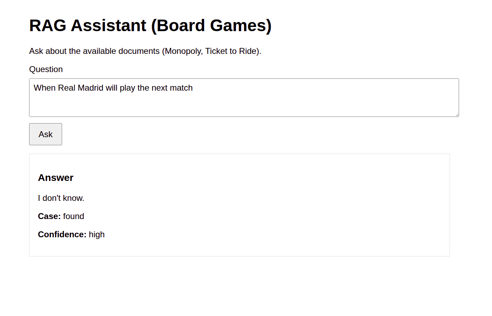

# RAG Demo Project

This repository contains a small Retrieval-Augmented Generation (RAG) demo built with LangChain, ChromaDB, OpenAI models, and a Flask web UI.

The project is designed to answer questions using only the information stored in the local document set. If the answer is not present in the documents, the assistant should respond with: `I don't know.`

## What's Included

- A notebook-based RAG pipeline in `myrag.ipynb` and `rag.ipynb`
- A Flask server in `app.py`
- A simple browser UI in `templates/index.html`
- Local vector storage in `chroma_db/` after the notebook or app builds the index

## How The Demo Works

1. Documents are loaded and split into smaller chunks.
2. Each chunk is embedded with `text-embedding-3-small`.
3. Chunks are stored in ChromaDB for semantic retrieval.
4. A user question is matched against the stored chunks.
5. The most relevant chunks are sent to `gpt-4o-mini` with a strict prompt.
6. The model answers only from the retrieved context.

The Flask app lazily initializes the embedding model, chat model, and Chroma vector store when the server starts.

## Project Structure

- `myrag.ipynb` - notebook version of the RAG pipeline and experimentation code
- `rag.ipynb` - alternate notebook used for RAG exploration
- `app.py` - Flask backend that powers the demo
- `templates/index.html` - minimal web interface for asking questions
- `requirements.txt` - pinned Python dependencies
- `chroma_db/` - persisted vector database created locally when the index is built

## Prerequisites

- Python 3.12 or compatible Python 3.11+
- A virtual environment is recommended
- An OpenAI API key

## Setup

1. Create and activate a virtual environment if you do not already have one.
2. Install dependencies:

```bash
python3 -m pip install -r requirements.txt
```

3. Create a `.env` file in the project root with your API key:

```bash
OPENAI_API_KEY=your_api_key_here
```

The application loads `.env` with override enabled so the value in the file takes precedence over any shell-exported variable.

## Running The Web App

Start the Flask server from the project root:

```bash
python3 app.py
```

Then open:

```text
http://127.0.0.1:5000/
```

The page lets you type a question and view the answer, retrieval case, and confidence indicator.

## API Endpoints

### `GET /`
Serves the browser UI.

### `POST /query`
Accepts JSON in the form:

```json
{ "question": "Your question here" }
```

Returns JSON with fields such as:

```json
{
	"answer": "...",
	"case": "found",
	"confidence": "high",
	"best_score": 0.42
}
```

If no relevant context is found, the response will typically be:

```json
{
	"answer": "I don't know.",
	"case": "no_relevant",
	"confidence": "low"
}
```

### `GET /health`
Returns a simple health check response:

```json
{ "status": "ok" }
```

## Notebook Workflow

The notebooks are useful if you want to inspect or rebuild the retrieval pipeline manually.

Typical notebook steps:

1. Load the source documents.
2. Split them into chunks.
3. Create embeddings.
4. Build the Chroma index.
5. Run retrieval tests.
6. Experiment with prompt wording or thresholds.

If you change dependencies or see stale imports in a notebook kernel, restart the kernel before re-running cells.

## Implementation Notes

- The app uses explicit `httpx.Client()` and `httpx.AsyncClient()` objects when initializing LangChain OpenAI wrappers.
- `httpx` is pinned to `0.27.2` to avoid compatibility issues with the OpenAI client stack.
- Retrieval uses Chroma similarity search with scores, and the app applies a conservative relevance threshold before calling the chat model.
- The prompt instructs the model to answer only from retrieved context.

## Troubleshooting

- If you get an authentication error, confirm that `.env` contains a valid `OPENAI_API_KEY`.
- If the app still uses the wrong key, restart the shell or server process so the updated environment is loaded.
- If Chroma is missing, reinstall dependencies inside the active virtual environment.
- If a notebook shows old package behavior, restart the kernel after changing packages.

## Useful Commands

```bash
python3 -m pip install -r requirements.txt
python3 app.py
```

## Demo Scope

This is a small educational demo, not a production RAG system. It is intended to show the end-to-end flow from document retrieval to answer generation with a minimal UI.

### Shoots
<p align="left">
  
</p>

<p align="left">
  
</p>