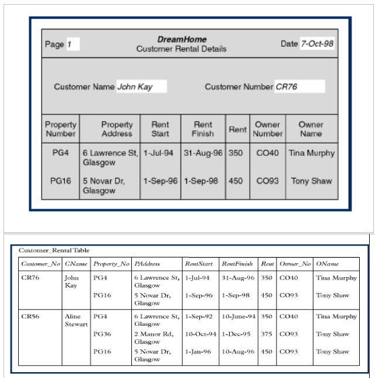
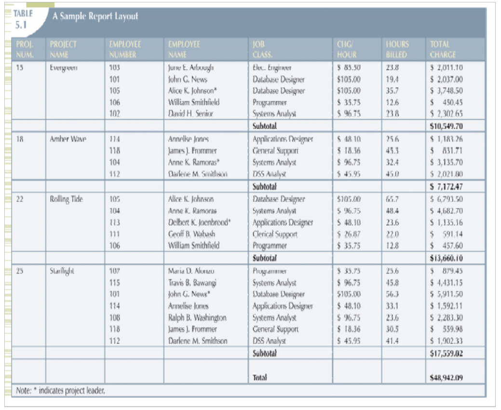

# Normalization Lab

## 1. DreamHome

Company designed to facilitate connecting people who are interested in properties renting and the owners of these properties. Note that ‘Rent’ is the value of the property cost, which determined by the negotiation between the customer and the owner. Use the below data to reach the 3rd Normal Form. Show your answer steps. Start with Customer number as a PK. Ignore Page number and Date mentioned in the below bill.

<p align="center">
  
</p>

---

### Step 1: 1st Normal Form (1NF)

**Rule**: Eliminate repeating groups → **one row per rental instance**

### Customer_Rental_1NF

| Customer_No | CName         | Property_No | PAddress                  | RentStart  | RentFinish | Rent | Owner_No | OName       |
|-------------|---------------|-------------|---------------------------|------------|------------|------|----------|-------------|
| CR76        | John Kay      | PG4         | 6 Lawrence St, Glasgow    | 1-Jul-94   | 31-Aug-96  | 350  | CO40     | Tina Murphy |
| CR76        | John Kay      | PG16        | 5 Novar Dr, Glasgow       | 1-Sep-96   | 1-Sep-98   | 450  | CO93     | Tony Shaw  |
| CR56        | Aline Stewart | PG4         | 6 Lawrence St, Glasgow    | 1-Sep-92   | 10-Jun-94  | 350  | CO40     | Tina Murphy |
| CR56        | Aline Stewart | PG36        | 2 Manor Rd, Glasgow       | 10-Oct-94  | 1-Dec-95   | 375  | CO93     | Tony Shaw  |
| CR56        | Aline Stewart | PG16        | 5 Novar Dr, Glasgow       | 1-Jan-96   | 10-Aug-96  | 450  | CO93     | Tony Shaw  |

> **1NF Achieved**: Atomic values, no repeating groups


----


### Step 2: 2nd Normal Form (2NF)
**Rule**: No Partial Dependancy

**2NF Tables**

- **Cutomer Table**

| Customer_No (PK) | CName         |
|------------------|---------------|
| CR76             | John Kay      |
| CR56             | Aline Stewart |

-------

- **Owner Table**

| Owner_No (PK) | OName         |
|------------------|---------------|
| CO40             | Tina Murphy |
| CO93             | Tony Shaw |

-------

- **Proberty Table**

| Property_No (PK) | PAddress                  | Owner_No (FK) |
|------------------|---------------------------|---------------|
| PG4              | 6 Lawrence St, Glasgow    | CO40          |
| PG16             | 5 Novar Dr, Glasgow       | CO93          |

-------

- **Rental Table**

| Customer_No (FK) | Property_No (FK) | RentStart (PK) | RentFinish | Rent |
|------------------|------------------|----------------|------------|------|
| CR76             | PG4              | 1-Jul-94       | 31-Aug-96  | 350  |
| CR76             | PG16             | 1-Sep-96       | 1-Sep-98   | 450  |

-------


### Step 3: 3nd Normal Form (3NF)
**Rule**: No Transitive Dependancy 

**3NF Tables**

- **Cutomer Table**

```plaintext
PK: Customer_No
```

| Customer_No (PK) | CName         |
|------------------|---------------|
| CR76             | John Kay      |
| CR56             | Aline Stewart |

-------

- **Owner Table**

```plaintext
PK: Owner_No
```

| Owner_No (PK) | OName         |
|------------------|---------------|
| CO40             | Tina Murphy |
| CO93             | Tony Shaw |

-------

- **Proberty Table**

```plaintext
PK: Property_No
```

| Property_No (PK) | PAddress                  | Owner_No (FK) |
|------------------|---------------------------|---------------|
| PG4              | 6 Lawrence St, Glasgow    | CO40          |
| PG16             | 5 Novar Dr, Glasgow       | CO93          |

-------

- **Rental Table**

```plaintext
PK: RentStart
```

| Customer_No (FK) | Property_No (FK) | RentStart (PK) | RentFinish | Rent |
|------------------|------------------|----------------|------------|------|
| CR76             | PG4              | 1-Jul-94       | 31-Aug-96  | 350  |
| CR76             | PG16             | 1-Sep-96       | 1-Sep-98   | 450  |

-------


## Sample Report Layout

The below report shows detailed information about the organization projects and the employees work for. As shown in below records; the project may have many employees; also, an employee may work for more than one project. Each job classification has a specific hourly rate (CHG/Hour). You are required to apply the 1st, 2nd and 3rd NF.

<p align="center">
  
</p>

---


### 1NF
- Elemenating Repeting groups, only atomic information

| PROJ_NUM | PROJECT NAME | EMP_NUM | EMP_NAME           | JOB_CLASS           | CHG_HOUR | HOURS_BILLED | TOTAL_CHARGE |
|----------|--------------|---------|--------------------|---------------------|----------|--------------|--------------|
| 15       | Evergreen    | 103     | June E. Arbough    | Elec. Engineer      | 85.50    | 23.8         | 2031.10      |
| 15       | Evergreen    | 101     | John G. News       | Database Designer   | 105.00   | 19.4         | 2037.00      |
| 15       | Evergreen    | 105     | Alice K. Johnson   | Database Designer   | 105.00   | 35.7         | 3748.50      |
| 15       | Evergreen    | 106     | William Smithfield | Programmer          | 35.75    | 12.6         | 450.45       |
| 15       | Evergreen    | 102     | David H. Senior    | Systems Analyst     | 96.75    | 23.8         | 2302.65      |


--------


### 2NF
- **Rule**: No Partial Dependency

#### Employee Table

| EMP_NUM (PK) | EMP_NAME           | JOB_CLASS           | CHG_HOUR |
|--------------|--------------------|---------------------|----------|
| 101          | John G. News       | Database Designer   | 105.00   |
| 102          | David H. Senior    | Systems Analyst     | 96.75    |
| 103          | June E. Arbough    | Elec. Engineer      | 85.50    |
| 104          | Anne K. Ramoras    | Systems Analyst     | 96.75    |
| 105          | Alice K. Johnson   | Database Designer   | 105.00   |


-----------------

#### Project Table

| PROJ_NUM (PK) | PROJECT_NAME |
|---------------|--------------|
| 15            | Evergreen    |
| 18            | Amber Wave   |
| 22            | Rolling Tide |
| 25            | Starlight    |

------------

#### Assigned Table

| PROJ_NUM (FK) | EMP_NUM (FK) | HOURS_BILLED |
|---------------|--------------|--------------|
| 15            | 103          | 23.8         |
| 15            | 101          | 19.4         |
| 15            | 105          | 35.7         |
| 15            | 106          | 12.6         |
| 15            | 102          | 23.8         |


--------


### 3NF
- **Rule**: No Transative Dependency

#### Employee Table

```plaintext
PK: EMP_NUM
```

| EMP_NUM (PK) | EMP_NAME           | 
|--------------|--------------------|
| 101          | John G. News       |
| 102          | David H. Senior    |
| 103          | June E. Arbough    |
| 104          | Anne K. Ramoras    |
| 105          | Alice K. Johnson   |


#### Job_class Table

```plaintext
PK: JOB_CLASS
```

| JOB_CLASS (PK) | CHG_HOUR         | 
|--------------|--------------------|
| Database Designer   | 105.00      |
| Systems Analyst     | 96.75       |
| Elec. Engineer      | 85.50       |
| Systems Analyst     | 96.75       |
| Database Designer   | 105.00      |


-----------------

#### Project Table

```plaintext
PK: PROJ_NUM
```
| PROJ_NUM (PK) | PROJECT_NAME |
|---------------|--------------|
| 15            | Evergreen    |
| 18            | Amber Wave   |
| 22            | Rolling Tide |
| 25            | Starlight    |

------------

#### Assigned Table

```plaintext
PK: (PROJ_NUM, EMP_NUM)
FK: PROJ_NUM -> Project
FK: EMP_NUM -> Employee
```

| PROJ_NUM (FK) | EMP_NUM (FK) | HOURS_BILLED |
|---------------|--------------|--------------|
| 15            | 103          | 23.8         |
| 15            | 101          | 19.4         |
| 15            | 105          | 35.7         |
| 15            | 106          | 12.6         |
| 15            | 102          | 23.8         |
