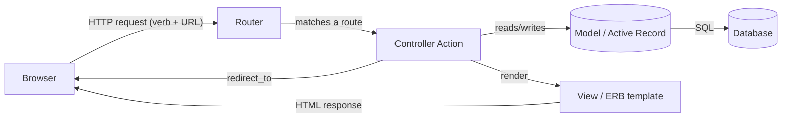
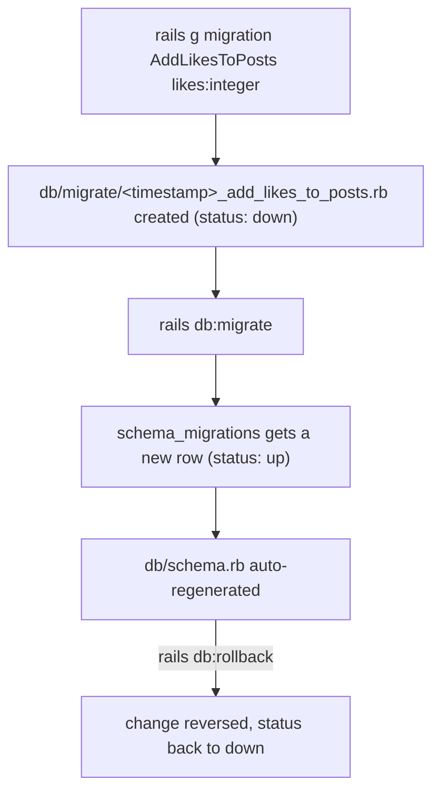
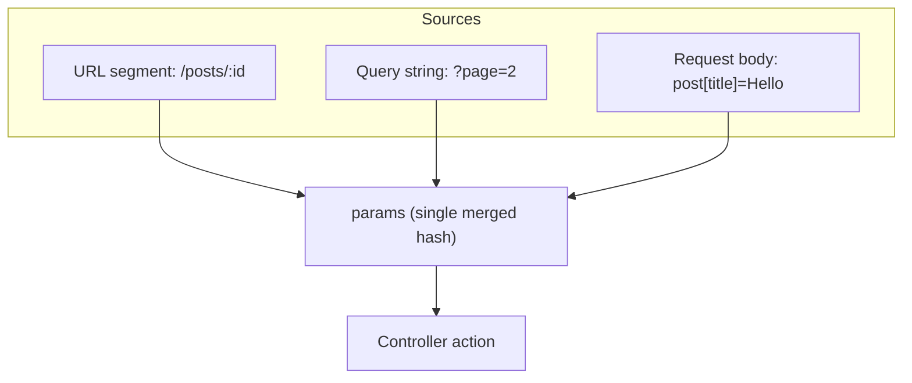

# Ruby on Rails — Day 2: Migrations, Models, MVC, and Full CRUD

## Overview

This lecture covers the journey of data in a Rails app from two angles that eventually meet in the middle:

1. **The database side**: how Rails creates and evolves database tables using **generators** and **migrations**, how the **schema** is tracked, and how to seed, reset, or explore the database directly.
2. **The application side**: how an HTTP request travels through **routing → controller → model → view** (the MVC pattern), how the **params** object carries data from the user into your code, and how a controller turns that data into a saved record and a rendered (or redirected) response.

By the end you should be able to explain, in your own words, what happens between a user clicking "Create Post" and a new row appearing in the `posts` table.

---

## Main Topics

### 1. The Rails Database Console (`rails db`)

#### Definition
`bin/rails db` (or `bundle exec rails db`) drops you into your database's **native command-line client**, already connected to whichever database your current Rails environment uses.

#### Why It Exists
Sometimes you want to look at raw tables, run a quick `SELECT`, or sanity-check that a migration actually changed what you think it changed — without spinning up a full Rails environment. This command saves you from manually figuring out connection strings, usernames, and database names; Rails reads all of that from `config/database.yml` for you.

#### How It Works
Rails reads `config/database.yml`, figures out which adapter you're using (SQLite, PostgreSQL, MySQL...), and execs into that database's own CLI tool — `sqlite3` for SQLite, `psql` for PostgreSQL, `mysql` for MySQL. You are no longer "in Rails" at this point; you're in the database engine's own shell.

#### Syntax
```bash
bundle exec rails db
```

#### Examples
Inside the SQLite shell:
```sql
.tables                    -- lists all tables
.schema posts               -- shows the full CREATE TABLE statement for "posts"
SELECT * FROM schema_migrations;
.quit                       -- or Ctrl+D to leave
```

A fresh Rails app (before you've created any of your own tables) has exactly **two** internal tables:
- `schema_migrations` — one row per migration that has been run, identified by its timestamp version.
- `ar_internal_metadata` — small key/value table Rails uses to track metadata about the app's environment (e.g., which environment created the database).

> **Correction:** one of the source notes wrote this table as `schema_migration` (singular). The real table name is **`schema_migrations`** (plural) — Rails pluralizes table names by convention, and this internal table is no exception.

#### Common Mistakes
- Forgetting you're now inside a *different* CLI (SQL syntax, not Ruby) and trying to run Ruby code.
- Querying `schema_migrations` expecting to see your table names — it only stores migration **version numbers**, not table structure (use `.schema` or `.tables` for that).

#### Best Practices
Use `rails db` for quick inspection only. For anything you'll do more than once (seeding, data fixes), write it in Ruby via `rails console` or a rake task instead, so it's reusable and version-controlled.

#### Real-World Usage
Developers reach for this constantly while debugging: "did that migration actually add the column?", "is this row really there?" — a 10-second detour instead of writing a script.

---

### 2. SQLite vs. PostgreSQL, and Rails' Database-Backed Caching

#### Definition
**SQLite** is a file-based database engine — the entire database lives in a single file on disk, with no separate server process. **PostgreSQL** ("Postgres") is a full client-server relational database. Rails defaults new apps to SQLite for development/testing because it requires zero setup, and many teams switch to PostgreSQL for production because it handles concurrent writes, scales further, and has richer features (full-text search, JSON columns, etc.).

#### Clarifying a confusing note
One of the source notes says: *"before rails used redis, now postgres and rails come with its caching way."* This is a garbled but real fact about **Rails 8**: previously, production Rails apps almost always reached for **Redis** as an external service to power caching, background job queues, and Action Cable (WebSockets). Rails 8 introduced **Solid Cache**, **Solid Queue**, and **Solid Cable** — these do the same jobs (caching, job queues, pub/sub) but store everything in your **existing relational database** (SQLite or PostgreSQL) instead of requiring a separate Redis server. So the note isn't really about "Postgres replacing SQLite" — it's about **your main database replacing Redis** for these supporting roles, which is a deliberate simplification Rails made to reduce the number of moving pieces a small/medium app needs in production.

#### Why It Exists
Fewer external dependencies = simpler deployment, especially for solo developers and small teams. You don't need to provision, monitor, and pay for a separate Redis instance just to get caching.

#### How It Works
Solid Cache creates its own tables (in the same or a separate database) and implements the standard Rails cache interface (`Rails.cache.fetch`, `Rails.cache.write`, etc.) on top of plain SQL reads/writes, with some performance tricks (like writing without primary keys) to keep it fast enough to compete with Redis for typical workloads.

#### Real-World Usage
You'll see this as a non-issue most of the time — you call `Rails.cache.fetch(...)` exactly the same way whether the backend is Redis or Solid Cache. The difference is purely in your `config/cache.yml` and what's running in production.

---

### 3. Generators (`rails generate` / `rails g`)

#### Definition
A **generator** is a built-in Rails CLI tool that scaffolds boilerplate files for you — migrations, models, controllers, tests, and more — following Rails' naming and folder conventions automatically.

#### Why It Exists
Every Rails app needs the same kinds of files in the same kinds of places. Instead of hand-typing a migration file with the correct timestamp-prefixed name, the correct class name, and the correct folder, a generator does it in one command and lets you focus on the actual logic.

#### Syntax
```bash
bundle exec rails generate <generator_type> <name> [arguments]
# shorthand:
bundle exec rails g <generator_type> <name> [arguments]
```

#### Examples
```bash
bundle exec rails g migration CreatePosts title:string content:text
bundle exec rails g model User name:string age:integer
bundle exec rails g controller Posts index show new create edit update destroy
```

#### Common Mistakes
Running a generator, not liking the result, and manually deleting files instead of using `rails destroy <same arguments>`, which cleanly undoes exactly what the generator created.

#### Best Practices
Let generators create the skeleton, then fill in business logic yourself. Don't fight the naming conventions they produce (e.g., renaming a generated `PostsController` to something non-standard) — Rails' "magic" depends on those names matching what it expects.

---

### 4. Migrations

#### Definition
A **migration** is a Ruby file that describes a *single, incremental change* to your database schema (create a table, add a column, add an index, etc.) in a way that can be applied ("migrated up") or undone ("migrated down" / rolled back).

#### Why It Exists
Without migrations, every developer on a team — and every server you deploy to — would need someone to manually run SQL `ALTER TABLE` statements in the right order, with no record of what's already been applied where. Migrations turn schema changes into **version-controlled, ordered, repeatable code**, exactly like Git tracks changes to your application code.

#### How It Works
1. You generate a migration. Rails creates a file at `db/migrate/<timestamp>_<name>.rb`.
2. The timestamp prefix (e.g., `20260619153012`) is what gives migrations a strict, unambiguous order — this is also how Rails decides which migration is "most recent" for rollback purposes.
3. Inside the file, a single `change` method describes the change **declaratively** — you say *what* you want (e.g., "add a column"), not *how* to write the SQL for both directions. Rails is smart enough to infer the *reverse* operation automatically for simple, reversible changes (e.g., it knows that undoing `add_column` is `remove_column`). This is the mechanism one of the source notes was gesturing at when it mentioned a "declarative syntax used by the `change` method."
4. Running `rails db:migrate` executes every migration that hasn't been applied yet, in timestamp order, and records each applied version in the `schema_migrations` table.
5. After migrating, Rails automatically regenerates `db/schema.rb` to reflect the database's current, total structure.

#### Syntax
```bash
bundle exec rails g migration CreatePosts title:string content:text
bundle exec rails g migration AddLikesToPosts likes:integer
bundle exec rails g migration RemoveLikesFromPosts likes:integer
bundle exec rails db:migrate
```

Generated file for the first command:
```ruby
class CreatePosts < ActiveRecord::Migration[7.1]
  def change
    create_table :posts do |t|
      t.string :title
      t.text :content
      t.timestamps
    end
  end
end
```

#### The "magic" naming convention, explained
One of the source notes asked: *"how did it know I'm adding a column to the existing `posts` table?"* The answer is **pure naming convention, not actual magic**: the migration generator pattern-matches the name you give it against templates like:

- `AddXxxToYyyy` → generates an `add_column :yyyy, :xxx, :type` body, targeting table `yyyy`.
- `RemoveXxxFromYyyy` → generates a `remove_column` body.
- `CreateXxxx` → generates a `create_table :xxxx` body.

If your migration name doesn't match one of these recognized patterns, Rails just gives you an empty `change` method and you write the body yourself — there's no real magic, just regex matching on the class name you typed.

#### Common Mistakes
- Editing a migration file *after* it has already been run and shared with teammates or pushed to a shared branch/`master`. This desyncs everyone whose database already applied the old version.
- Forgetting to run `db:migrate` after generating a migration, then wondering why the table/column doesn't exist yet, or why `schema.rb` looks unchanged.
- Manually editing `db/schema.rb` — it is **auto-generated**; your edits will be silently overwritten the next time a migration runs.

#### Best Practices
- **Golden rule:** if a migration has been migrated *and shared* (pushed to `master`, deployed, or run by a teammate), never edit it — write a brand-new migration that changes things further. If a migration is still purely local and unmigrated (or you're willing to roll it back locally), it's fine to edit it before re-running.
- Keep each migration focused on one logical change.
- Always check `schema.rb` after migrating to confirm what actually happened.

#### Real-World Usage
Migrations are how every Rails team keeps local dev databases, CI databases, staging, and production all in sync over the lifetime of a project — often hundreds or thousands of migrations deep.

---

### 5. Migration Status & Rollback

#### Definition
- `rails db:migrate:status` lists every migration Rails knows about and whether each one is currently **up** (applied to this database) or **down** (not yet applied).
- `rails db:rollback` undoes the most recently *applied* migration by running its inverse operation.

#### How It Works
Rollback doesn't care about "up vs down" as a question you ask it — it looks at the `schema_migrations` table, finds the highest-versioned migration currently marked **up**, and reverses just that one. To go back further, use `STEP=n`.

#### Syntax
```bash
bundle exec rails db:migrate:status
bundle exec rails db:rollback            # undoes the single most recent migration
bundle exec rails db:rollback STEP=2     # undoes the 2 most recent migrations
bundle exec rails db:migrate             # re-applies all currently "down" migrations, in order
```

#### Examples
After a rollback, that migration's row in `db:migrate:status` flips from `up` to `down`. If you then edit the migration file and run `rails db:migrate` again, only that (now "down") migration re-runs — Rails skips everything still marked "up".

#### Common Mistakes
Rolling back a migration that's already been deployed to production or pulled by teammates — their database still thinks it's "up" while yours says "down," causing confusing schema drift.

#### Best Practices
Use `db:rollback` freely on migrations that exist *only* on your machine. Once shared, prefer writing a new corrective migration instead.

---

### 6. Models (`rails g model`)

#### Definition
A **model** is a Ruby class (living in `app/models/`) that represents one row of one database table and inherits from `ActiveRecord::Base` (directly or via `ApplicationRecord`). It's where validations, associations (relationships between models), and business logic live.

#### Why It Exists
Without a model layer, you'd be writing raw SQL strings throughout your controllers every time you wanted to read or write data. **Active Record** (Rails' Object-Relational Mapper, or ORM) lets you instead write Ruby method calls like `Post.find(3)` or `post.save`, and it translates those into the correct SQL behind the scenes.

#### How It Works
`rails g model User name:string age:integer` does **four things in one command**:
1. Creates `app/models/user.rb` with an empty `User` class.
2. Creates a migration (`db/migrate/..._create_users.rb`) for the matching table.
3. Creates a test file (`test/models/user_test.rb`) and a fixture file (`test/fixtures/users.yml`).
4. Does **not** touch `schema.rb` yet — that note's uncertainty was correct to flag: the migration still has to be *run* (`rails db:migrate`) before the table actually exists and `schema.rb` updates.

> **Confirmation:** the source note guessed at this command but wasn't sure it was right — it is correct. `rails g model <Name> <col>:<type> ...` is the standard one-shot way to create a model plus its backing migration together.

#### Syntax
```bash
bundle exec rails g model User name:string age:integer
bundle exec rails db:migrate
```

#### Convention link
Model class names are **singular and PascalCase** (`User`), while the table they map to is automatically the **plural, snake_case** version (`users`) — Rails infers this both ways without you configuring anything, using the `ActiveSupport::Inflector` library.

#### Common Mistakes
Naming a model `Users` (plural) — Rails conventions expect singular, and going against this forces you to manually override the table name everywhere.

#### Best Practices
Keep models focused on data and domain logic (validations, scopes, associations, small business-rule methods). Avoid stuffing HTTP/request-handling logic into models — that belongs in controllers.

---

### 7. Validations

#### Definition
**Validations** are rules declared inside a model that must pass before a record is allowed to be saved to the database (e.g., "content can't be blank").

#### Why It Exists
The database itself can enforce some constraints (like `NOT NULL`), but Active Record validations give you richer, application-level rules with friendly error messages, *before* a query ever hits the database — faster feedback and far more expressive than raw SQL constraints alone.

#### Syntax
```ruby
class Post < ApplicationRecord
  validates_presence_of :content
  # equivalent, more common modern style:
  validates :content, presence: true
end
```

#### How It Works
When you call `post.save` (or `post.update`), Active Record runs every validation on the model first. If any fail, `save` returns `false`, **nothing is written to the database**, and the specific errors are collected on `post.errors` for you to display back to the user.

#### Answering the source note's question directly
*"Is `status: :unprocessable_content` only for when content is null, or for any error?"* — **For any validation error, of any kind, on any field.** The `if @post.save / else render ...` pattern is generic: `save` returns `false` whenever *any* validation fails (blank content, blank title, a custom validation, a uniqueness check, etc.), and the `else` branch always re-renders the same form with `@post.errors` available to display whatever went wrong.

#### Common Mistakes
Forgetting that a failed `save` doesn't raise an exception by default — it just returns `false`. Forgetting the `if/else` check entirely means a failed save silently does nothing and the user gets no feedback.

#### Best Practices
Always check the boolean return of `save`/`update`/`destroy` (or use the "bang" versions like `save!`, which raise exceptions instead, in contexts like seeds or console where you want loud failures).

---

### 8. Database Setup, Seeding & Resetting

#### Definition
| Command | What it does |
|---|---|
| `rails db:create` | Creates the database itself (just the empty database, no tables) |
| `rails db:migrate` | Runs pending migrations to build/update tables |
| `rails db:seed` | Runs `db/seeds.rb` to insert data |
| `rails db:setup` | Does **all three in sequence**: create → migrate → seed (used for a brand-new database) |
| `rails db:drop` | Deletes the entire database |

#### Clarifying "seed data syncing across environments"
The source note flagged confusion here: *"seed can put dummy data and can make sync in production [didn't get that part of sync]."* The key idea: `seeds.rb` isn't only for throwaway fake data — it's commonly used for **essential reference data** that every environment (dev, staging, production) needs to function: default user roles, a list of countries, a default admin account, plan tiers, etc. Because `db:seed` can safely be re-run, teams often write seeds using `find_or_create_by` so re-running it doesn't create duplicates — this is what makes it safe to run in production too, to keep that baseline data "in sync" everywhere, not just in your local dev database.

#### Syntax
```ruby
# db/seeds.rb
Post.find_or_create_by!(title: "Welcome") do |post|
  post.content = "First post!"
end
```
```bash
bundle exec rails db:seed
```

#### Common Mistakes
Writing seeds with plain `Post.create` instead of `find_or_create_by` — re-running `db:seed` then creates duplicate rows every time.

#### Best Practices
Use `db:setup` for a fresh clone of the project; use `db:seed` alone when you just want to re-insert/update seed data without touching existing tables or migrations.

---

### 9. The Rails Console

#### Definition
`rails console` (or `rails c`) opens an interactive Ruby REPL with your entire Rails application already loaded — every model, every gem, every helper is available.

#### How It Works
A normal web request flows: **Browser → Router → Controller → Model → Database**. In the console, you skip straight to: **Terminal → Model → Database** — you're calling Active Record methods directly, with no HTTP layer, no routing, and no controller/view in between.

> Minor refinement to the source note's phrasing ("bypass all layers and execute in db directly"): the console doesn't talk to the database *directly* — it still goes through Active Record (the model layer), which is what translates your Ruby calls into SQL. What it bypasses is the **router, controller, and view** layers, not the model/ORM layer itself.

#### Syntax
```bash
bundle exec rails console
# or
bundle exec rails c
```
```ruby
Post.all
Post.find(1)
Post.create(title: "Test", content: "Hello")
```

#### Real-World Usage
The console is the single most-used debugging tool in Rails development — checking data, testing a method, fixing a bad record on the fly.

---

### 10. Routing & RESTful Resources

#### Definition
**Routing** maps an incoming HTTP request (a verb + a URL path, like `GET /posts/3`) to a specific controller action. `resources :posts` in `config/routes.rb` is a single line that generates a full, conventional set of RESTful routes for the `Post` resource.

#### Why It Exists
Almost every resource in a typical app needs the same seven operations (list, show one, show a creation form, create, show an edit form, update, delete). Rather than writing seven separate route declarations every time, `resources :posts` generates all of them in their conventional REST shape in one line.

#### Syntax
```ruby
# config/routes.rb
resources :posts
```

#### The 7 generated routes

| HTTP Verb | Path | Controller#Action | Purpose |
|---|---|---|---|
| GET | `/posts` | `posts#index` | List all records |
| GET | `/posts/new` | `posts#new` | Render the "create" form |
| POST | `/posts` | `posts#create` | Save a new record |
| GET | `/posts/:id` | `posts#show` | View one record |
| GET | `/posts/:id/edit` | `posts#edit` | Render the "update" form |
| PATCH/PUT | `/posts/:id` | `posts#update` | Save changes to a record |
| DELETE | `/posts/:id` | `posts#destroy` | Remove a record |

#### Common Mistakes
Confusing `new`/`create` (and `edit`/`update`) as the same action — they're paired but distinct: `new` only **renders a blank form**; `create` is the one that actually **persists data**.

#### Best Practices
Default to `resources :posts` and only restrict it (e.g., `resources :posts, only: [:index, :show]`) when you genuinely don't need every action — don't hand-write individual `get`/`post` lines for standard CRUD.

---

### 11. Controllers & the 7 RESTful Actions

#### Definition
A **controller** is a Ruby class in `app/controllers/` that groups together the action methods for one resource. Each public method matches one of the seven conventional actions and is responsible for fetching/saving data via the model, then deciding what to send back to the browser (a rendered view, or a redirect).

#### Naming/terminology correction
The source notes drew a comparison to a PHP framework's naming (`store` vs Rails' `create`, `store` form-display action vs Rails' `new`). That comparison is accurate as a memory aid, but to keep things framework-neutral: Rails' naming is **`new`** (show empty form) → **`create`** (persist) and **`edit`** (show pre-filled form) → **`update`** (persist changes). Compare this instead to, say, an Express/NestJS REST controller, where you'd typically see separate route handlers like `GET /posts/new` (rare in API-only frameworks) and `POST /posts`, or to Django's `CreateView`/`UpdateView` class-based views, which split the same way: a GET that renders a form, and a POST/PATCH that performs the write.

#### How It Works — full code walkthrough

```ruby
class PostsController < ApplicationController

  # GET /posts
  def index
    @posts = Post.all
  end

  # GET /posts/new
  def new
    @post = Post.new   # an unsaved, empty Post object — title: nil, content: nil
  end

  # POST /posts
  def create
    @post = Post.new(title: params[:post][:title], content: params[:post][:content])
    if @post.save
      redirect_to @post, notice: "Post created"
    else
      render :new, status: :unprocessable_content
    end
  end

  # GET /posts/:id
  def show
    @post = Post.find(params[:id])
  end

  # GET /posts/:id/edit
  def edit
    @post = Post.find(params[:id])
  end

  # PATCH /posts/:id
  def update
    @post = Post.find(params[:id])
    if @post.update(title: params[:post][:title], content: params[:post][:content])
      redirect_to @post, notice: "Post Updated"
    else
      render :edit, status: :unprocessable_content
    end
  end

  # DELETE /posts/:id
  def destroy
    @post = Post.find(params[:id])
    @post.destroy
    redirect_to posts_path, notice: "Deleted successfully"
  end
end
```

**Line-by-line / concept-by-concept:**

- `@posts = Post.all` — `@` makes this an **instance variable**, which Rails automatically exposes to the matching view file (`index.html.erb`) without you passing it explicitly. This is convention, not magic-magic: Rails just shares instance variables between a controller action and the view it renders.
- `Post.new` (in `new`) builds an **unsaved, in-memory object only** — nothing touches the database yet. It exists purely so the form has something to bind fields to (and so empty fields render correctly).
- `params[:post][:title]` — see the dedicated **params** section below for the full explanation of where this nested structure comes from.
- `@post.save` — runs validations, and only if they all pass, issues an `INSERT` SQL statement. Returns `true`/`false`.
- `redirect_to @post, notice: "..."` — covered in detail in the **render vs redirect_to** section below.
- `render :new, status: :unprocessable_content` — re-displays the `new` template *without* a new HTTP request, but now `@post` carries `.errors`, so the form can show what went wrong. The explicit `status:` tells the browser (and any JS/Turbo intercepting the response) that this wasn't a successful save.
- `@post.destroy` issues a `DELETE` SQL statement, then the controller redirects to the index listing (note: the original source notes had this redirecting to `@post`, which would be a bug — you can't show a record that no longer exists; redirecting to `posts_path`, the index, is the conventional, correct target after a destroy).

**What happens if parts are removed:**
- Remove the `if/else` around `@post.save` → a failed save just silently does nothing visible; the page still tries to render the (nonexistent) default `create.html.erb` and errors out, since `create` has no view of its own.
- Remove `params[:id]` from `Post.find(...)` → `find` has no argument to look up, and raises an `ArgumentError`.
- Remove `status: :unprocessable_content` → the form still re-renders fine for a human in a browser, but any JavaScript (or Turbo, or an API client) checking the HTTP status code would incorrectly think the request succeeded (default render status is `200 OK`).

#### Common Mistakes
- Forgetting that **`create`, `update`, and `destroy` have no view files of their own** — they only ever `render` an *existing* view (typically `new` or `edit` on failure) or `redirect_to` somewhere else. Writing a `create.html.erb` file is a sign something's off.
- Calling `Post.find` with an id that doesn't exist — raises `ActiveRecord::RecordNotFound` (Rails turns this into a 404 page automatically in development/production).

#### Best Practices
Keep controllers "thin" — fetch/save data and decide on a response; push any complex business logic into the model (or a service object) instead of bloating the controller action.

#### Real-World Usage
This exact seven-action shape is what almost every CRUD resource in a Rails app looks like — comments, products, orders, users — making codebases very predictable to navigate once you know the pattern.

---

### 12. The `params` Object — Deep Dive

#### Definition
`params` is a single Ruby hash-like object (technically `ActionController::Parameters`) available in every controller action, containing **every piece of data sent with the request, regardless of where it came from.**

#### Answering the source note's questions directly
*"Does params hold only `{post: {title: ...}}`-style data, or other stuff too? Can it hold data from both the form and the URL?"* — **Yes to both.** `params` is a merge of three sources into one hash:

1. **Route/URL segment parameters** — e.g., the `:id` in `/posts/:id` becomes `params[:id]`.
2. **Query string parameters** — e.g., `?page=2` becomes `params[:page]`.
3. **Request body parameters** — form fields (or JSON body, for an API) submitted with the request.

Additionally, **every** request's `params` always includes `params[:controller]` and `params[:action]`, which Rails uses internally for routing/logging — these are present even though you didn't "send" them yourself.

#### How the nested shape happens
When a Rails form field is named `post[title]` (which `form_with model: @post` generates automatically based on the model's class name), the server-side parameter parser turns that bracket syntax into a **nested hash**: `params[:post][:title]`. This is just HTML form-naming convention plus Rails parsing it — nothing model-specific is required for it to work; you'd get the same nesting from any form field literally named `post[title]`.

#### Syntax / Example
```ruby
# Incoming request: PATCH /posts/5  with body post[title]=Hello&post[content]=World
params[:id]              # => "5"   (from the URL)
params[:post][:title]    # => "Hello"  (from the form body)
params[:post][:content]  # => "World"
params[:controller]      # => "posts"
params[:action]          # => "update"
```

#### Common Mistakes
Treating `params` as a plain Ruby `Hash` for everything — it behaves like one for reading values, but it's actually `ActionController::Parameters`, which is why Rails requires you to explicitly "permit" fields (**strong parameters**, e.g., `params.require(:post).permit(:title, :content)`) before mass-assigning them to a model, as a security measure against attackers submitting unexpected fields.

#### Best Practices
Always use strong parameters (a private `post_params` method calling `.require(...).permit(...)`) rather than pulling individual fields out one by one as in the walkthrough above — the line-by-line version was shown for teaching clarity, but production Rails code almost always uses the strong-parameters pattern instead.

---

### 13. Views, ERB & Partials

#### Definition
A **view** is a template file (by default, `.html.erb` — HTML mixed with embedded Ruby) that renders the actual HTML sent to the browser. A **partial** is a small, reusable view fragment, conventionally named with a **leading underscore** (e.g., `_post.html.erb`), meant to be rendered from inside other views.

#### The four CRUD view files (and why three actions have none)

| File | Used by action |
|---|---|
| `index.html.erb` | loops through `@posts`, displaying all records |
| `show.html.erb` | displays one `@post` |
| `new.html.erb` | renders a blank form |
| `edit.html.erb` | renders a form pre-filled with `@post`'s current data |

`create`, `update`, and `destroy` have **no matching view files** — by design. Their entire job is to mutate the database and then either `render` one of the four templates above (on failure) or `redirect_to` somewhere else (on success).

#### Partials — confirming the source note's instinct
The note correctly spotted the underscore convention: `_post.html.erb` is a partial. The leading underscore is purely a **filename convention** signaling "don't render this directly as a full page response — it's meant to be included from another view," similar in spirit to a reusable component in a frontend framework like React or Vue, except rendered server-side.

```erb
<%# app/views/posts/_post.html.erb %>
<div class="post">
  <h2><%= post.title %></h2>
  <p><%= post.content %></p>
</div>

<%# app/views/posts/index.html.erb %>
<%= render @posts %>   <%# renders _post.html.erb once per post in @posts %>
```

#### Common Mistakes
Forgetting the underscore when creating a partial file — Rails won't find it, since `render @posts` specifically looks for a file named `_<model_name>.html.erb`.

#### Best Practices
Extract a partial whenever the same chunk of markup is repeated in more than one view (e.g., a post "card" shown in both `index` and a user's profile page).

---

### 14. `render` vs `redirect_to`

#### Definition
- **`render`** tells Rails to take the *current* request/response cycle and fill it with a specific view's HTML — **no new HTTP request happens**, and the browser's URL bar does **not** change.
- **`redirect_to`** sends the browser an HTTP redirect response (a 302, typically), instructing it to issue a **brand-new** HTTP request to a different URL.

#### Why both exist
They solve different problems. `render` is for "show this template right now, using data I already have in memory" (e.g., re-showing a form with validation errors attached). `redirect_to` is for "tell the browser to navigate somewhere else entirely," most famously to implement the **Post/Redirect/Get (PRG) pattern**.

#### Answering the source note's question
*"`post.save()` then `redirect_to @post` — is that a GET?"* **Yes.** `redirect_to @post` sends a 302 response pointing at `/posts/:id`. The browser then automatically issues a **new GET request** to that URL — which is exactly the `show` route. This is the PRG pattern: **P**ost the form, **R**edirect, then **G**et the result page — it prevents the classic "refresh resubmits the form" problem, since the URL the browser ends up sitting on (`GET /posts/5`) is safely re-requestable/refreshable.

#### How `redirect_to @post` knows the URL
Passing a *model instance* (rather than a path string) to `redirect_to` relies on Rails' **URL helper** machinery: Rails calls `.to_param` on the object (by default, just its `id`) and combines it with the resource's route to build `/posts/5` automatically. This is why `resources :posts` in your routes file is what makes `redirect_to @post` work at all — without that route declared, Rails wouldn't know how to turn a `Post` object into a URL.

#### Common Mistakes
Using `render` after a successful `create`/`update`/`destroy` — refreshing the page then **re-submits the same form data**, potentially creating duplicate records. Always `redirect_to` after a successful write.

#### Best Practices
**Render on failure** (you need the user's already-entered, now-invalid data to redisplay), **redirect on success** (you want a clean new GET request and a shareable/refreshable URL).

---

### 15. Flash Messages (`notice`)

#### Definition
`notice:` (and its sibling `alert:`) is shorthand for setting a one-time **flash message** — a small piece of data that survives exactly one redirect and is then automatically cleared.

#### How It Works
`redirect_to @post, notice: "Post created"` is equivalent to setting `flash[:notice] = "Post created"` and then redirecting. The flash hash is stored in the session temporarily; after the *next* request reads it (typically in your layout, via `<%= flash[:notice] %>`), Rails clears it so it doesn't keep reappearing on every subsequent page.

#### Best Practices
Use `notice` for success messages and `alert` for warnings/errors as a team-wide convention — both are just flash keys, but this split keeps templates predictable (e.g., styling `alert` red, `notice` green).

---

### 16. HTTP Status Codes: `:unprocessable_content` vs `:unprocessable_entity`

#### Definition
Both symbols map to HTTP status **422**, signaling "the server understood the request, but the data was semantically invalid" (the classic case: failed validations).

#### Why two names exist
The 422 status was historically named "**Unprocessable Entity**" in the HTTP spec, and `:unprocessable_entity` was the long-standing Rails symbol for it. The underlying spec (RFC 9110) later renamed the official reason phrase to "**Unprocessable Content**," and starting with Rack 3.1, `:unprocessable_entity` was marked **deprecated** in favor of `:unprocessable_content`. As of modern Rails (7.1+/8), both symbols still resolve to 422, but `:unprocessable_content` is the current, non-deprecated spelling — which is exactly what the source notes used, so that detail was correct, just worth knowing *why*.

#### Best Practices
On a current Rails version, prefer `:unprocessable_content`. If you see `:unprocessable_entity` in older tutorials or gems, know that it still works today but may eventually be removed from Rack.

---

## Code Walkthrough

The full controller above already received a line-by-line walkthrough in its section. Two additional behind-the-scenes notes worth highlighting:

- **What SQL does `@post.save` generate (on create)?** Roughly:
  ```sql
  INSERT INTO posts (title, content, created_at, updated_at) VALUES (?, ?, ?, ?);
  ```
  Active Record automatically adds/updates `created_at`/`updated_at` if your migration included `t.timestamps` — this is why none of the controller code sets those fields manually.

- **What SQL does `Post.find(params[:id])` generate?**
  ```sql
  SELECT * FROM posts WHERE id = ? LIMIT 1;
  ```
  If no row matches, Active Record raises `ActiveRecord::RecordNotFound` rather than returning `nil` — this is a deliberate design choice ("fail loudly") that `find` makes; the similar method `find_by(id: ...)` returns `nil` instead if you'd rather handle a missing record manually.

---

## Rails Architecture



- **Router** (`config/routes.rb`) — decides which controller#action handles a request.
- **Controller** — orchestrates: pulls input from `params`, talks to the model, decides on a response.
- **Model / Active Record** — represents and validates data, talks to the database.
- **View** — renders the final HTML (or JSON, etc.) using data the controller exposed via instance variables.
- **Migrations** sit slightly outside this request cycle — they're a one-time, offline process that shapes what the **Model**/database layer even looks like.

---

## Convention Over Configuration

This lecture is full of examples of Rails' core philosophy — *sensible defaults over manual setup*:

| You write... | Rails infers... |
|---|---|
| Migration named `AddLikesToPosts` | "add a column to the `posts` table" |
| Model class `Post` | table name `posts` |
| `@post` instance variable in a controller action | automatically available in that action's matching view |
| File named `_post.html.erb` | "this is a partial, not a standalone page" |
| Form field named `post[title]` | nested `params[:post][:title]` |
| `redirect_to @post` | builds `/posts/5` via `resources :posts` + `.to_param` |
| `create`/`update`/`destroy` actions | no matching view files expected |

This is the heart of "Convention over Configuration": as long as you follow Rails' naming conventions, an enormous amount of wiring happens automatically. Step outside the conventions (irregular pluralization, mismatched names) and you start needing manual configuration to compensate.

---

## Deep Understanding

**Migrations**
- *Problem solved:* uncoordinated, undocumented database changes across a team/deployment pipeline.
- *Advantages:* version-controlled, reversible, ordered, environment-portable.
- *Disadvantages:* can get unwieldy in very large, long-lived apps (hundreds of migration files); irreversible migrations (e.g., destructive data transformations) need careful, manual `up`/`down` methods instead of relying on `change`'s auto-reversal.
- *Alternatives:* hand-written SQL scripts (loses ordering/tracking benefits), schema-diffing tools in other ecosystems (e.g., Django migrations, Prisma migrate, Sequelize migrations) — all solve the same core problem with similar mechanics.

**`params` + strong parameters**
- *Problem solved:* safely handling untrusted, attacker-controllable input that arrives as a single unstructured hash.
- *Advantages:* one unified interface regardless of where data came from (URL, query string, body).
- *Disadvantages:* the "everything is one big hash" design means **you must explicitly whitelist fields** (strong parameters) or risk mass-assignment vulnerabilities.

---

## Comparisons

**Rails RESTful controller actions vs. other frameworks**

| Concept | Rails | Django | Express / NestJS |
|---|---|---|---|
| Show empty creation form | `new` action, `new.html.erb` | `CreateView` (GET) | Often skipped in API-only apps; SSR frameworks render a form route |
| Persist new record | `create` action | `CreateView` (POST) | `POST /posts` route handler |
| Show one record | `show` action | `DetailView` | `GET /posts/:id` route handler |
| Update form + persist | `edit` / `update` | `UpdateView` (GET/POST) | `GET /posts/:id/edit` (SSR) + `PATCH /posts/:id` |
| Validation failure response | re-`render` same template, 422 status | re-render form with errors, 200 (commonly) | manually return 4xx + error JSON |

The core idea — *separate "show a form" from "process a submission"* — is universal across web frameworks; Rails just gives it very explicit, conventional names.

---

## Visual Diagrams

**Migration lifecycle**



**The `params` hash, by source**



---

## Quick Revision Notes

- `rails db` → opens the native DB shell (sqlite3/psql/mysql) for raw inspection.
- `rails g migration AddXToY col:type` → name pattern auto-generates the `add_column` body.
- `rails db:migrate` → applies pending migrations, regenerates `schema.rb` (never hand-edit it).
- `rails db:migrate:status` → shows up/down per migration.
- `rails db:rollback [STEP=n]` → undoes the most recently applied migration(s).
- Never edit a migration that's already migrated *and shared* — write a new one instead.
- `rails g model X col:type` → model + migration + test + fixture, in one command (still needs `db:migrate`).
- Validations (`validates :field, presence: true`) block `save`/`update` from writing to the DB and populate `.errors`.
- `db:create` / `db:migrate` / `db:seed` = the three steps `db:setup` runs automatically.
- `rails console` → Terminal → Model → DB, skipping router/controller/view.
- `resources :posts` → 7 RESTful routes (index, new, create, show, edit, update, destroy).
- `create`/`update`/`destroy` have **no view files** — they only `render` an existing view (on failure) or `redirect_to` (on success).
- `params` merges URL segments + query string + request body into one hash; always includes `:controller`/`:action`.
- `_partial.html.erb` (leading underscore) = reusable view fragment.
- `render` = same request, no URL change. `redirect_to` = brand-new request, URL changes (PRG pattern).
- `:unprocessable_content` (422) — current preferred symbol; `:unprocessable_entity` still works but is deprecated.

---

## Interview / Exam Questions

**Q: What's the difference between `render` and `redirect_to`, and when would you use each?**
A: `render` reuses the current request/response to display a view immediately, with no new HTTP request and no URL change — used when you need to redisplay data you already have (e.g., a form with validation errors). `redirect_to` sends a 302 response telling the browser to make a brand-new request to a different URL — used after a successful write, to implement the Post/Redirect/Get pattern and avoid duplicate form resubmission on refresh.

**Q: Why shouldn't you edit a migration file that has already been run and shared with your team?**
A: Once a migration has been applied (and especially once teammates or production have run it too), the database's `schema_migrations` table already reflects the *old* version of that file. Editing the file doesn't retroactively change already-migrated databases — it only desyncs your file from what's actually been applied elsewhere. The fix is to write a new migration that makes the further change you need.

**Q: Where does the nested `params[:post][:title]` structure come from?**
A: From the HTML form field's `name` attribute being `post[title]` (which Rails' `form_with model: @post` generates automatically). Rails' parameter parser interprets bracket syntax in form field names as nested hash structure when building the `params` object.

**Q: Why do `create`, `update`, and `destroy` not have their own view templates?**
A: Their job is purely to mutate the database and then respond with either a `render` of an *existing* template (typically re-showing `new` or `edit` on failure) or a `redirect_to` elsewhere (on success) — they never need a dedicated template of their own.

**Q: What does `resources :posts` actually generate, and why is it preferred over writing routes manually?**
A: It generates the seven conventional RESTful routes (index, new, create, show, edit, update, destroy) mapped to `PostsController` in one line, following REST naming and HTTP-verb conventions automatically — avoiding repetitive, error-prone manual route declarations for what is, in the vast majority of apps, an identical pattern resource after resource.

**Q: What's the practical difference between `:unprocessable_entity` and `:unprocessable_content`?**
A: Both map to HTTP 422 and behave identically at runtime. `:unprocessable_entity` is the older Rails symbol, now deprecated as of Rack 3.1+ in favor of `:unprocessable_content`, which matches the renamed official HTTP reason phrase per RFC 9110.

---

## Key Takeaways

1. **Migrations are the version control system for your database schema** — declarative, ordered by timestamp, and (for simple changes) automatically reversible via the `change` method.
2. **Never hand-edit `schema.rb`** — it's a generated snapshot, always produced fresh by running migrations.
3. **Rails infers a huge amount from naming conventions alone** — migration names, model/table pluralization, instance-variable-to-view sharing, partial filenames, and form-field bracket syntax all drive automatic behavior.
4. **`params` is one unified hash** regardless of whether data came from the URL, the query string, or the request body — and always carries `:controller`/`:action` too.
5. **`render` vs `redirect_to` is really "same request" vs "new request,"** which is why the standard pattern is: render on validation failure, redirect on success (the PRG pattern).
6. **Only 4 of the 7 CRUD actions have view templates** (`index`, `show`, `new`, `edit`) — the three that mutate data (`create`, `update`, `destroy`) only ever render an existing template or redirect.
7. **Seeds aren't just for fake/dummy data** — they're often essential, idempotent baseline data meant to exist consistently across every environment, including production.
