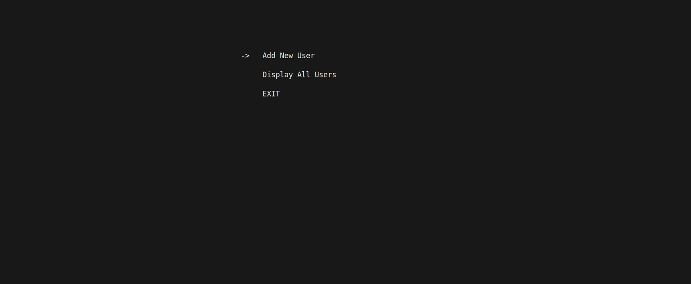
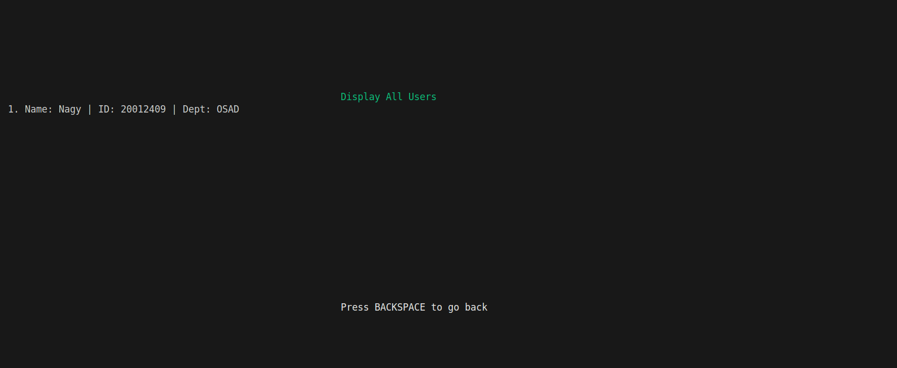
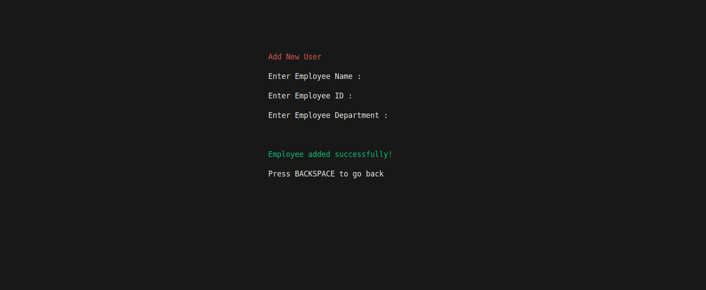
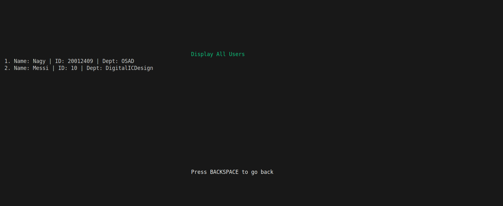

## Application Flow

**Screen 1 - Main Menu**
- Navigate between: New Employee, Display All, Exit options

  

**Screen 2 - Add Employee**
- Enter employee name, ID, and department

  

**Screen 3 - Back to Main Menu**
- Return to menu after adding employee

  

**Screen 4 - Display Database**
- View all stored employees with their details

  

**Screen 5 - Add Another Employee**
- Add second employee to database

  

**Screen 6 - Updated Database**
- Shows both employees now stored and persisted

  

